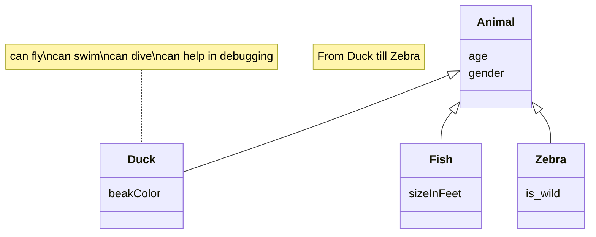

# Documento de análisis de requisitos del sistema
**Asignatura:** Diseño y Pruebas (Grado en Ingeniería del Software, Universidad de Sevilla)

**Curso académico:** 2025/2026 

**Grupo/Equipo:** L2-01  

**Nombre del proyecto:** Escape from Elba 

**Repositorio:** https://github.com/gii-is-DP1/dp1-2025-2026-l2-01  

**Integrantes:** 

Alberto Pardina Miñón (QSS7721 / albparmin@alum.us.es) 
Marco Visentin Lopez (CYB6650 / marvislop@alum.us.es) 
Emilio Diaz Arcenegui (FSS8078 / emidiaarc@alum.us.es) 
Nerea Camacho Perez (QFL3393 / nercamper@alum.us.es) 
Laura Cubero Sánchez (XNT3290 / laucubsan@alum.us.es) 
Lucía Baltasar Muñoz (SBJ4592 / lucbalmun@alum.us.es) 

## Introducción

Este proyecto se dedica a la implementación del juego de mesa llamado "Escape From Elba" de 1999, el cual por cada partida puede ser disfrutado desde 3 a 6 jugadores, con una duración media de 60 minutos. 

La partida comienza colocando a los visitantes, para esto cada uno lanza dos dados, uno negro y otro blanco, colocando a su personaje en la habitación que estos indiquen. Posteriormente se reparten 3 cartas a cada jugador (si deseas jugar con más de 6 jugadores, se recomienda repartir solo 2 cartas iniciales) y se elige a un jugador de manera aleatoria para que este comience, siendo el siguiente el de su izquierda.
El ojetivo trata de obtener un conjunto de cartas, ya sea robando del mazo o de otros jugadores, las cuales te permitan escapar, cada carta represnenta una letra (cada una muestra todas las palabras del juego en las que se encuentra), también puedes tener cartas boca arriba sobre la mesa las cuales se considerarán como tu "bolsa", estas cartas son las que te permitirán formar palabras que te ayuden a escapar, luchar y moverte por los alrededores. Para escapar es necesario ganar fuerza (todos los jugadores empiezan con 1 de fuerza), la cual se consigue haciendo batallas contra otros jugadores.
### Batallas
El jugador que entra a una habitación ya ocupada siempre será considerado como el atacante (en caso de empate, contará como victorioso), ambos jugadores lanzan un dado y se le suma sus puntos de fuerza (también es posible utilizar armas si puedes formarlas con la palabra de tu "bolsa"). Si pierdes la batalla contra otro jugador ganas fuerza (se descarta una carta a su elección de la mano o de la "bolsa" si es contra Niall Campbell). Sin embargo, si ganas contra otro jugador puedes elegir entre robar una carta de su "bolsa" o una aleatoria de su mano (la carta superior del mazo de descarte si es contra Niall Cambell o una del mazo de robo si es contra cualquier otro visitante NPC).
### Turnos
El primer paso es robar cartas, puedes robar cuantas cartas quieras hasta alcanzar 7 cartas en tu mano (dependiendo de cuantas cartas tengas afectará a los puntos de acción de tu turno). Si tienes 7 o más cartas, no recibes ningún punto de acción, si tienes menos, recibes 7 menos el número de cartas en tu mano, por ejemplo si tienes 5 cartas, obtienes 2 puntos. 

Puedes gastar tus puntos en diferentes acciones: 
- Moverte a una habitación adyacente a la tuya. 
- Mover a un jugador visitante NPC a una habitación adyacente a la suya. 
- Saltar a una habitación si eres capaz de formar algun nombre de alguna habitación con la palabra de tu "bolsa", por ejemplo si tienes "APPEARS", puedes dirigirte a "**SPA**" o a "SAFE **AREA**" (si es una palabra compuesta solo debes formar una de las palabras que la componen). Siempre y cuando no sea una torre de escape. 
- Hacer un intento de escape, siempre que estes en una de las torres de escape (a no ser que sea "EMPEROR" o "CAMPBELL", cuyas palabras pueden usarse en cualquier ubicación), puedas formar su nombre con la palabra en tu "bolsa". Para que el intento sea exitoso, debes lanzar un dado y sacar un número inferior a tu fuerza. Si el intento es fallido, se lanzna los dados para moverte a una habitación aleatoria. 
- Por ultimo, puedes descartarte de tantas cartas como quieras y debes vaciar tu mochila, quedandote con 2 letras o 3 si eres capaz de formar una palabra con estas.

### Vídeo explicativo de las normas de Escape From Elba
[https://youtu.be/JjQOi04i2-0?si=LMb-skomsHNsHqmz]

## Tipos de Usuarios / Roles

Jugador: Usuario que puede tanto ver su información registrada en el juego como crear y/o unirse a partidas.

Administrador: Grupo de usuarios que pueden ver una lista de datos generales del juego como partidas y jugadores, gestionar sus usuarios y modificar los logros del juego.

## Historias de Usuario

A continuación se definen  todas las historias de usuario a implementar:
_Os recomentamos usar la siguiente plantilla de contenidos que usa un formato tabular:_
 ### HU-(ISSUE#ID): Nombre ([Enlace a la Issue asociada a la historia de usuario]()
|Descripción de la historia siguiendo el esquema:  "Como <rol> quiero que el sistema <funcionalidad>  para poder <objetivo/beneficio>."| 
|-----|
|Mockups (prototipos en formato imagen de baja fidelidad) de la interfaz de usuario del sistema|
|Decripción de las interacciones concretas a realizar con la interfaz de usuario del sistema para lleva a cabo la historia. |

## Gestión de usuarios

|Como jugador quiero poder registrarme, iniciar y cerrar sesión para poder jugar con mis datos.| 
|-----|
|Mockups (prototipos en formato imagen de baja fidelidad) de la interfaz de usuario del sistema|

|Como jugador quiero editar mi perfil personal para que mis datos estén actualizados.| 
|-----|
|Mockups (prototipos en formato imagen de baja fidelidad) de la interfaz de usuario del sistema|

|Como administrador quiero ver un listado de usuarios registrados con paginación para saber quiénes son los jugadores de la partida.| 
|-----|
|Mockups (prototipos en formato imagen de baja fidelidad) de la interfaz de usuario del sistema|

|Como administrador quiero realizar operaciones CRUD sobre los usuarios para mantener actualizado el sistema, poder comprobar la seguridad, poder borrar en cascada partidas, estadísticas, etc.| 
|-----|
|Mockups (prototipos en formato imagen de baja fidelidad) de la interfaz de usuario del sistema|

## Estadísticas 

|Como jugador quiero poder ver el número de partidas jugadas para observar estadísticas | 
|-----|
|Mockups (prototipos en formato imagen de baja fidelidad) de la interfaz de usuario del sistema|

|Como jugador quiero poder ver la duración de las partidas jugadas para saber si dispongo del tiempo necesario| 
|-----|
|Mockups (prototipos en formato imagen de baja fidelidad) de la interfaz de usuario del sistema|

|Como jugador quiero poder ver el número de jugadores por partida jugada para observar estadísticas| 
|-----|
|Mockups (prototipos en formato imagen de baja fidelidad) de la interfaz de usuario del sistema|

|Como jugador quiero poder ver un ranking de jugadores para fomentar mi competitividad| 
|-----|
|Mockups (prototipos en formato imagen de baja fidelidad) de la interfaz de usuario del sistema|

|Como jugador quiero poder ver mis logros en mi perfil para ver cómo avanzo en el juego | 
|-----|
|Mockups (prototipos en formato imagen de baja fidelidad) de la interfaz de usuario del sistema|

|Como administrador quiero poder editar los logros para adaptarlos a nuevos criterios | 
|-----|
|Mockups (prototipos en formato imagen de baja fidelidad) de la interfaz de usuario del sistema|

    ## Juego social

|Como jugador quiero enviar, gestionar y recibir invitaciones de amistad para poder jugar juntos.| 
|-----|
|Mockups (prototipos en formato imagen de baja fidelidad) de la interfaz de usuario del sistema|

|Como jugador quiero enviar y recibir invitaciones a partidas (bien en modo jugador o en modo espectador) para poder ver el juego o jugar.| 
|-----|
|Mockups (prototipos en formato imagen de baja fidelidad) de la interfaz de usuario del sistema|

|Como jugador quiero acceder con modo espectador de mis amigos para ver como juegan sin necesidad de participar.| 
|-----|
|Mockups (prototipos en formato imagen de baja fidelidad) de la interfaz de usuario del sistema|

|Como jugador quiero escribir y leer comentarios en un chat durante las partidas para poder comunicarme con los demás jugadores.| 
|-----|
|Mockups (prototipos en formato imagen de baja fidelidad) de la interfaz de usuario del sistema|

## Diagrama conceptual del sistema
_En esta sección debe proporcionar un diagrama UML de clases que describa el modelo de datos a implementar en la aplicación. Este diagrama estará anotado con las restricciones simples (de formato/patrón, unicidad, obligatoriedad, o valores máximos y mínimos) de los datos a gestionar por la aplicación. _

_Recuerde que este es un diagrama conceptual, y por tanto no se incluyen los tipos de los atributos, ni clases específicas de librerías o frameworks, solamente los conceptos del dominio/juego que pretendemos implementar_
Ej:

_Si vuestro diagrama se vuelve demasiado complejo, siempre podéis crear varios diagramas para ilustrar todos los conceptos del dominio. Por ejemplo podríais crear un diagrama para cada uno de los módulos que quereis abordar. La única limitación es que hay que ser coherente entre unos diagramas y otros si nos referimos a las mismas clases_

_Puede usar la herramienta de modelado que desee para generar sus diagramas de clases. Para crear el diagrama anterior nosotros hemos usado un lenguaje textual y librería para la generación de diagramas llamada Mermaid_

_Si deseais usar esta herramienta para generar vuestro(s) diagramas con esta herramienta os proporcionamos un [enlace a la documentación oficial de la sintaxis de diagramas de clases de _ermaid](https://mermaid.js.org/syntax/classDiagram.html)_

## Reglas de Negocio
### R1 - Número de jugadores
En cada partida debe asegurarse un mínimo de 3 jugadores y un máximo de 6 jugadores, y a cada jugador se le reparten 3 cartas.

### R1.1 - Más de 6 jugadores
Si se desea jugar con más de 6 jugadores, se reparten solo 2 cartas iniciales.

### R2 - Condiciones para ganar
Para que un jugador pueda considerarse ganador, deberá cumplir los siguientes 3 requisitos.

### R2.1 - Posesión de palabra de escape
El jugador deberá tener en su Bolsa una palabra válida de escape (ESCAPE, FROM, ELBA, PEACE, EMPEROR o CAMPBELL).

### R2.2 - Ubicación correspondiente
Las palabras de escape ESCAPE, FROM, ELBA y PEACE solo podrán utilizarse en la torre correspondiente, excepto EMPEROR y CAMPBELL, que permiten escapar desde cualquier sitio.

### R2.3 - Tirada inferior a Fuerza
El jugador deberá tirar su dado y obtener una tirada inferior a su fuerza actual.

### R3 - Gestión de cartas
El jugador deberá cumplir una serie de requisitos en cuanto a la gestión de las cartas en cada turno.

### R3.1 - Robo
La mano de 7 es un límite de robo, no de posesión; está permitido terminar el turno con más de 7 si efectos de combate lo provocan, pero nunca se puede robar por encima de 7 en el paso de robo.

### R3.2 - Limitaciones Bolsa
La Bolsa solo puede contener una palabra en inglés de 3 o más letras, o un máximo de 2 letras sueltas si no es capaz de formar una palabra. En caso de ser nombres propios solo se admitiran "CAMPBELL" y "ELBA".

### R3.3 - Cartas descartadas
Las cartas descartadas van al montón de descarte.
   
### R4 - Ganar puntos de acción
En cada turno, un jugador puede ganar puntos de acción en función del número de cartas que tenga en su mano tras robar. Si tiene 7 o más cartas, no gana ningún punto de acción. Si tiene menos de 7 cartas, gana puntos de acción igual a 7 menos el número de cartas en su mano.
Puntos = 7 - Número de cartas en mano.

### R5 - Usos de los Puntos de acción
Los puntos de acción ganados en un turno pueden ser usados para realizar las siguientes acciones:

### R5.1 - Moverse a una habitación adyacente
Un jugador puede gastar 1 punto de acción para moverse a una habitación adyacente a la suya.

### R5.2 - Mover a un jugador visitante NPC
Un jugador puede gastar 1 punto de acción para mover a un jugador visitante NPC a una habitación, esto puede provocar una batalla si la habitación ya está ocupada.

### R5.3 - Saltar a una habitación
Un jugador puede gastar 1 punto de acción para saltar a una habitación si puede formar el nombre de la habitación con las cartas en su bolsa.

### R5.4 - Intento de escape
Un jugador puede gastar 1 punto de acción para hacer un intento de escape si está en una de las torres de escape y puede formar su nombre o una de las palabras especiales con las cartas en su bolsa.

### R6 - Combates
Existen una serie de requisitos en cuanto a los combates

### R6.1 - Obligatoriedad de combate
Cada vez que un jugador entra en una sala ocupada, se formará un combate (Excepto en la Zona Segura o entre 2 NPCs)

### R6.2 - Catapulta
Si un jugador es catapultado a una sala ocupada, se deberá iniciar inmediatamente un nuevo combate, incluso si esto ocurre varias veces consecutivas. Si se cae en la misma sala se pelea de nuevo. (La sala a la que se es catapultado se elegirá aleatoriamente mediante tirada de dados)

### R6.3 - Incremento de Fuerza del personaje
Cada derrota aumenta la Fuerza del perdedor en +1, un jugador nunca puede superar un nivel de Fuerza superior a 6.

### R6.4 - Empates
En caso de empate, el atacante ganará automáticamente.

### R6.5 - Victoria
El personaje con mayor fuerza es quien gana la batalla, esta fuerza se calcula con la fuerza que tengamos más la tirada del dado, de forma opcional se pueden usar armas si se tienen en la bolsa que suman 1 punto de fuerza cada una.

### R6.5.1 - Victoria contra otro jugador
Si el jugador gana la batalla contra otro jugador, podrá elegir entre robar una carta aleatoria de su mano o una carta de su bolsa.

### R6.5.2 - Victoria contra Niall Campbell
Si el jugador gana la batalla contra Niall Campbell, podrá robar la carta superior del mazo de descarte.

### R6.5.3 - Victoria contra un NPC
Si el jugador gana la batalla contra un NPC, podrá robar una carta del mazo de robo.

### R6.6 - Derrota
El jugador que pierde la batalla sera catapultado, ganara 1 de fuerza (maximo 6) y dependiendo de contra quien pierda, se aplicaran las siguientes reglas:

### R6.6.1 - Derrota contra otro jugador
Si el jugador pierde la batalla contra otro jugador, pierde la carta que el ganador elija, ya sea de su mano o de su bolsa y perdera todos los puntos de acción restantes.

### R6.6.2 - Derrota contra NPC
Si el jugador pierde la batalla contra un NPC, pierde una carta a eleccion de su mano o bolsa.

### R7 - Fallo en Escape
Un intento de escape fallido implicará: ser lanzado a una sala aleatoria, perder todos los puntos de acción restantes, ganar 1 de fuerza (Máximo 6) y descartar una carta de elección propia.

### R8 - Posicion inicial de Campbell
Niall Campbell siempre comienza la partida en la Zona Segura.

### R9 - Partida unica
Cada jugador solo puede estar en una partida a la vez.

### R10 - Dados
Cada jugador juega con un dado de 6 caras, mientras que Niall Campbell juega con un dado especial llamado "Master die" tambien de 6 caras pero diferenciable por su color.

### R11 - Habitaciones de inicio
Cada jugador comienza la partida en una habitación determinada por la tirada de dos dados (uno negro y otro blanco). Si un jugador queda ubicado en una habitacion ocupada, este tirara de nuevo.

### R12 - Distribucion predefinida
Se juega con un total de 64 cartas.

### R13 - Barajar y remezclar
Cuando el mazo de robo se agota, se baraja inmediatamente el descarte para formar un nuevo mazo y se continúa robando sin pausa en el mismo paso de juego.

### R14 - Jugador inicial
Se escoge mediante azar el jugaor con tirada de dados mas alta y se siguen los turnos de manera descendente, en caso de empate repiten la tirada solo los empatados.

### R15 - Flujo de cartas estricto
Las cartas pasan de la mano a la Bolsa y de esta al mazo de descartes, nunca en sentido inverso salvo por efectos de botín de combate o robos del mazo de robo/descarte definidos; está prohibido pasar del descarte a la bolsa o mano sin un evento de juego que lo permita.

### R16 - Orden del turno
Durante el turno se sigue el orden de 1º robar, 2º tomar accion y por ultimo descartar, y es imposible volver a la fase anterior en caso de avanzar.
