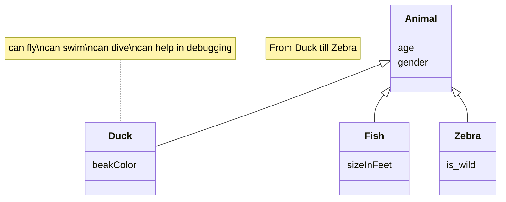

# Documento de análisis de requisitos del sistema
**Asignatura:** Diseño y Pruebas (Grado en Ingeniería del Software, Universidad de Sevilla)

**Curso académico:** 2025/2026 

**Grupo/Equipo:** L2-01  

**Nombre del proyecto:** Escape from Elba 

**Repositorio:** https://github.com/gii-is-DP1/dp1-2025-2026-l2-01  

**Integrantes:** 

Alberto Pardina Miñón (QSS7721 / albparmin@alum.us.es) 
Marco Visentin Lopez (CYB6650 / marvislop@alum.us.es) 
Emilio Diaz Arcenegui (FSS8078 / emidiaarc@alum.us.es) 
Nerea Camacho Perez (QFL3393 / nercamper@alum.us.es) 
Laura Cubero Sánchez (XNT3290 / laucubsan@alum.us.es) 
Lucía Baltasar Muñoz (SBJ4592 / lucbalmun@alum.us.es) 

## Introducción

Este proyecto se dedica a la implementación del juego de mesa llamado "Escape From Elba" de 1999, el cual por cada partida puede ser disfrutado desde 3 a 6 jugadores, con una duración media de 60 minutos. 
La partida comienza colocando a los visitantes, para esto cada uno lanza dos dados, uno negro y otro blanco, colocando a su personaje en la habitación que estos indiquen. Posteriormente se reparten 3 cartas a cada jugador (si deseas jugar con más de 6 jugadores, se recomienda repartir solo 2 cartas iniciales) y se elige a un jugador de manera aleatoria para que este comience, siendo el siguiente el de su izquierda.
El ojetivo trata de obtener un conjunto de cartas, ya sea robando del mazo o de otros jugadores, las cuales te permitan escapar, cada carta represnenta una letra (cada una muestra todas las palabras del juego en las que se encuentra), también puedes tener cartas boca arriba sobre la mesa las cuales se considerarán como tu "bolsa", estas cartas son las que te permitirán formar palabras que te ayuden a escapar, luchar y moverte por los alrededores. Para escapar es necesario ganar fuerza (todos los jugadores empiezan con 1 de fuerza), la cual se consigue haciendo batallas contra otros jugadores.
 **Batallas** 
El jugador que entra a una habitación ya ocupada siempre será considerado como el atacante (en caso de empate, contará como victorioso), ambos jugadores lanzan un dado y se le suma sus puntos de fuerza (también es posible utilizar armas si puedes formarlas con la palabra de tu "bolsa"). Si pierdes la batalla contra otro jugador ganas fuerza (se descarta una carta a su elección de la mano o de la "bolsa" si es contra Niall Campbell). Sin embargo, si ganas contra otro jugador puedes elegir entre robar una carta de su "bolsa" o una aleatoria de su mano (la carta superior del mazo de descarte si es contra Niall Cambell o una del mazo de robo si es contra cualquier otro visitante NPC).
 **Turnos** 
El primer paso es robar cartas, puedes robar cuantas cartas quieras hasta alcanzar 7 cartas en tu mano (dependiendo de cuantas cartas tengas afectará a los puntos de acción de tu turno). 
Si tienes 7 o más cartas, no recibes ningún punto de acción, si tienes menos, recibes 7 menos el número de cartas en tu mano, por ejemplo si tienes 5 cartas, obtienes 2 puntos. 
Puedes gastar tus puntos en diferentes acciones: 
-Moverte a una habitación adyacente a la tuya. 
-Mover a un jugador visitante NPC a una habitación adyacente a la suya. 
-Saltar a una habitación si eres capaz de formar algun nombre de alguna habitación con la palabra de tu "bolsa", por ejemplo si tienes "APPEARS", puedes dirigirte a "**SPA**" o a "SAFE **AREA**" (si es una palabra compuesta solo debes formar una de las palabras que la componen). Siempre y cuando no sea una torre de escape. 
-Hacer un intento de escape, siempre que estes en una de las torres de escape (a no ser que sea "EMPEROR" o "CAMPBELL", cuyas palabras pueden usarse en cualquier ubicación), puedas formar su nombre con la palabra en tu "bolsa". Para que el intento sea exitoso, debes lanzar un dado y sacar un número inferior a tu fuerza. Si el intento es fallido, se lanzna los dados para moverte a una habitación aleatoria. 
-Por ultimo, puedes descartarte de tantas cartas como quieras y debes vaciar tu mochila, quedandote con 2 letras o 3 si eres capaz de formar una palabra con estas.

[https://youtu.be/JjQOi04i2-0?si=LMb-skomsHNsHqmz]

## Tipos de Usuarios / Roles

Jugador: Usuario que puede tanto ver su información registrada en el juego como crear y/o unirse a partidas.

Administrador: Grupo de usuarios que pueden ver una lista de datos generales del juego como partidas y jugadores, gestionar sus usuarios y modificar los logros del juego.

## Historias de Usuario

A continuación se definen  todas las historias de usuario a implementar:
_Os recomentamos usar la siguiente plantilla de contenidos que usa un formato tabular:_
 ### HU-(ISSUE#ID): Nombre ([Enlace a la Issue asociada a la historia de usuario]()
|Descripción de la historia siguiendo el esquema:  "Como <rol> quiero que el sistema <funcionalidad>  para poder <objetivo/beneficio>."| 
|-----|
|Mockups (prototipos en formato imagen de baja fidelidad) de la interfaz de usuario del sistema|
|Decripción de las interacciones concretas a realizar con la interfaz de usuario del sistema para lleva a cabo la historia. |

## Diagrama conceptual del sistema
_En esta sección debe proporcionar un diagrama UML de clases que describa el modelo de datos a implementar en la aplicación. Este diagrama estará anotado con las restricciones simples (de formato/patrón, unicidad, obligatoriedad, o valores máximos y mínimos) de los datos a gestionar por la aplicación. _

_Recuerde que este es un diagrama conceptual, y por tanto no se incluyen los tipos de los atributos, ni clases específicas de librerías o frameworks, solamente los conceptos del dominio/juego que pretendemos implementar_
Ej:

_Si vuestro diagrama se vuelve demasiado complejo, siempre podéis crear varios diagramas para ilustrar todos los conceptos del dominio. Por ejemplo podríais crear un diagrama para cada uno de los módulos que quereis abordar. La única limitación es que hay que ser coherente entre unos diagramas y otros si nos referimos a las mismas clases_

_Puede usar la herramienta de modelado que desee para generar sus diagramas de clases. Para crear el diagrama anterior nosotros hemos usado un lenguaje textual y librería para la generación de diagramas llamada Mermaid_

_Si deseais usar esta herramienta para generar vuestro(s) diagramas con esta herramienta os proporcionamos un [enlace a la documentación oficial de la sintaxis de diagramas de clases de _ermaid](https://mermaid.js.org/syntax/classDiagram.html)_

## Reglas de Negocio
### R1 - Número de jugadores
En cada partida debe asegurarse un mínimo de 3 jugadores y un máximo de 6 jugadores. 

### R4 - Ganar puntos de acción
En cada turno, un jugador puede ganar puntos de acción en función del número de cartas que tenga en su mano tras robar. Si tiene 7 o más cartas, no gana ningún punto de acción. Si tiene menos de 7 cartas, gana puntos de acción igual a 7 menos el número de cartas en su mano.
Puntos = 7 - Número de cartas en mano.

### R5 - Usos de los Puntos de acción
Los puntos de acción ganados en un turno pueden ser usados para realizar las siguientes acciones:

### R5.1 - Moverse a una habitación adyacente
Un jugador puede gastar 1 punto de acción para moverse a una habitación adyacente a la suya.

### R5.2 - Mover a un jugador visitante NPC
Un jugador puede gastar 1 punto de acción para mover a un jugador visitante NPC a una habitación, esto puede provocar una batalla si la habitación ya está ocupada.

### R5.3 - Saltar a una habitación
Un jugador puede gastar 1 punto de acción para saltar a una habitación si puede formar el nombre de la habitación con las cartas en su bolsa.

### R5.4 - Intento de escape
Un jugador puede gastar 1 punto de acción para hacer un intento de escape si está en una de las torres de escape y puede formar su nombre o una de las palabras especiales con las cartas en su bolsa.

### R8 - Posicion inicial de Campbell
Niall Campbell siempre comienza la partida en la Zona Segura.

_Ej:_ 
### R1 – Diagnósticos imposibles
El diagnóstico debe estar asociado a una enfermedad que es compatible con el tipo de mascota de su visita relacionada. Por ejemplo, no podemos establecer como enfermedad diagnosticada una otitis cuando la visita está asociada a una mascota que es un pez, porque éstos no tienen orejas ni oídos (y por tanto no será uno de los tipos de mascota asociados a la enfermedad otitis en el vademecum).

…

_Muchas de las reglas del juego se transformarán en nuestro caso en reglas de negocio, por ejemplo, “la carta X solo podrá jugarse en la ronda Y si en la ronda anterior se jugó la carta Z”, o “en caso de que un jugador quede eliminado el turno cambia de sentido”_

