# Documento de análisis de requisitos del sistema
**Asignatura:** Diseño y Pruebas (Grado en Ingeniería del Software, Universidad de Sevilla)

**Curso académico:** 2025/2026 

**Grupo/Equipo:** L2-01  

**Nombre del proyecto:** Escape from Elba 

**Repositorio:** https://github.com/gii-is-DP1/dp1-2025-2026-l2-01  

**Integrantes:** 

Alberto Pardina Miñón (QSS7721 / albparmin@alum.us.es) 
Marco Visentin Lopez (CYB6650 / marvislop@alum.us.es) 
Emilio Diaz Arcenegui (FSS8078 / emidiaarc@alum.us.es) 
Nerea Camacho Perez (QFL3393 / nercamper@alum.us.es) 
Laura Cubero Sánchez (XNT3290 / laucubsan@alum.us.es) 
Lucía Baltasar Muñoz (SBJ4592 / lucbalmun@alum.us.es) 

## Introducción

Este proyecto se dedica a la implementación del juego de mesa llamado "Escape From Elba" de 1999, el cual por cada partida puede ser disfrutado desde 3 a 6 jugadores, con una duración media de 60 minutos. 

### Materiales
Los materiales para jugar son muy simples, ya que se componen principalmente de dos:

- El tablero, el cual está formado por un distinto número de habitaciones, en cada una aparece su nombre (lo cual será importante para una de las mecánicas principales del juego) y dos dados, uno negro y otro blanco (los cuales servirán para colocar a los jugadores en habitaciones aleatorias).

- Las cartas, en las cuales destacan dos partes esenciales. La primera letra del nombre de la carta, situada en la esquina superior izquierda y el conjunto de palabras de escape que se puede formar con esta letra.

 

 
### Objetivo
La partida comienza colocando a los visitantes, para esto cada uno lanza dos dados, uno negro y otro blanco, colocando a su personaje en la habitación que estos indiquen. Posteriormente se reparten 3 cartas a cada jugador (si deseas jugar con más de 6 jugadores, se recomienda repartir solo 2 cartas iniciales) y se elige a un jugador de manera aleatoria para que este comience, siendo el siguiente el de su izquierda.
El ojetivo trata de obtener un conjunto de cartas, ya sea robando del mazo o de otros jugadores, las cuales te permitan escapar, cada carta represnenta una letra (cada una muestra todas las palabras del juego en las que se encuentra), también puedes tener cartas boca arriba sobre la mesa las cuales se considerarán como tu "bolsa", estas cartas son las que te permitirán formar palabras que te ayuden a escapar, luchar y moverte por los alrededores. Para escapar es necesario ganar fuerza (todos los jugadores empiezan con 1 de fuerza), la cual se consigue haciendo batallas contra otros jugadores.

### Batallas
El jugador que entra a una habitación ya ocupada siempre será considerado como el atacante (en caso de empate, contará como victorioso), ambos jugadores lanzan un dado y se le suma sus puntos de fuerza (también es posible utilizar armas si puedes formarlas con la palabra de tu "bolsa"). Si pierdes la batalla contra otro jugador ganas fuerza (se descarta una carta a su elección de la mano o de la "bolsa" si es contra Niall Campbell). Sin embargo, si ganas contra otro jugador puedes elegir entre robar una carta de su "bolsa" o una aleatoria de su mano (la carta superior del mazo de descarte si es contra Niall Cambell o una del mazo de robo si es contra cualquier otro visitante NPC).

### Turnos
El primer paso es robar cartas, puedes robar cuantas cartas quieras hasta alcanzar 7 cartas en tu mano (dependiendo de cuantas cartas tengas afectará a los puntos de acción de tu turno). Si tienes 7 o más cartas, no recibes ningún punto de acción, si tienes menos, recibes 7 menos el número de cartas en tu mano, por ejemplo si tienes 5 cartas, obtienes 2 puntos. 

Puedes gastar tus puntos en diferentes acciones: 
- Moverte a una habitación adyacente a la tuya. 
- Mover a un jugador visitante NPC a una habitación adyacente a la suya. 
- Saltar a una habitación si eres capaz de formar algun nombre de alguna habitación con la palabra de tu "bolsa", por ejemplo si tienes "APPEARS", puedes dirigirte a "**SPA**" o a "SAFE **AREA**" (si es una palabra compuesta solo debes formar una de las palabras que la componen). Siempre y cuando no sea una torre de escape. 
- Hacer un intento de escape, siempre que estes en una de las torres de escape (a no ser que sea "EMPEROR" o "CAMPBELL", cuyas palabras pueden usarse en cualquier ubicación), puedas formar su nombre con la palabra en tu "bolsa". Para que el intento sea exitoso, debes lanzar un dado y sacar un número inferior a tu fuerza. Si el intento es fallido, se lanzna los dados para moverte a una habitación aleatoria. 
- Por ultimo, puedes descartarte de tantas cartas como quieras y debes vaciar tu mochila, quedandote con 2 letras o 3 si eres capaz de formar una palabra con estas.

### Vídeo explicativo de las normas de Escape From Elba
[https://youtu.be/JjQOi04i2-0?si=LMb-skomsHNsHqmz]

## Tipos de Usuarios / Roles

Jugador (en partida): puede participar en las partidas y jugar acorde a las reglas de juego, como tirar dados, desplazarse a diferentes habitaciones, etc.

Jugador registrado: puede acceder a las diferentes funcionalidades del sistema como crear partidas, usar el chat, etc.

Espectador: puede observar partidas en tiempo real sin participar. De esta forma, pueden ver jugar a sus amigos y aprender sobre el juego.

Administrador: grupo de usuarios con acceso total al sistema. Pueden ver una lista de datos generales del juego como partidas y jugadores, gestionar sus usuarios y modificar los logros del juego.

## Historias de Usuario

A continuación se definen  todas las historias de usuario a implementar:

## Juego

### HU-001
|Como jugador quiero crear una partida pudiendo configurarla como yo desee para poder jugar.| 
|-----|
|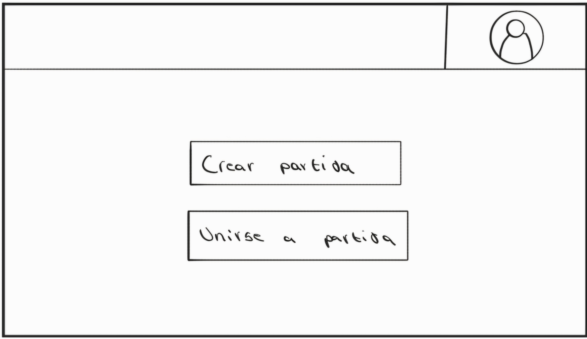|
|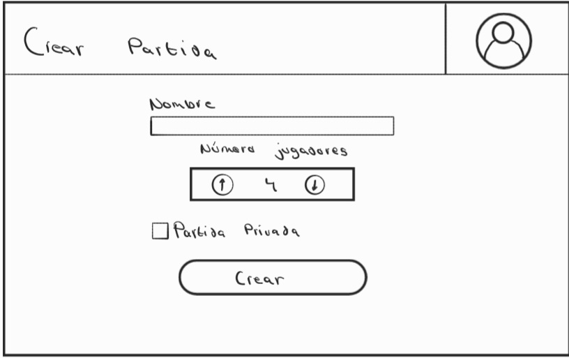|
|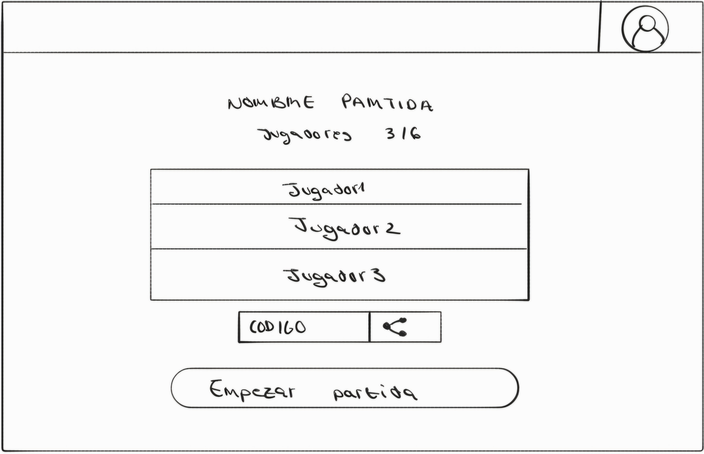|
|El jugador podrá crear una partida con las opciones que el quiera, pudiendo elegir el número maximo de jugadores, el nombre de la partida y si quiere que sea privada o pública. Cuando el jugador configure la partida el sistema le llevará a una sala de espera en la que irán apareciendo los jugadores que se vayan uniendo, en el caso de ser una partida privada también aparecerá el codigo que permite a otros jugadores unirse. El jugador podrá empezar la partida cuando el quiera usando el botón de empezar partida. |

### HU-002
|Como jugador quiero unirme a una partida para poder jugar.| 
|-----|
|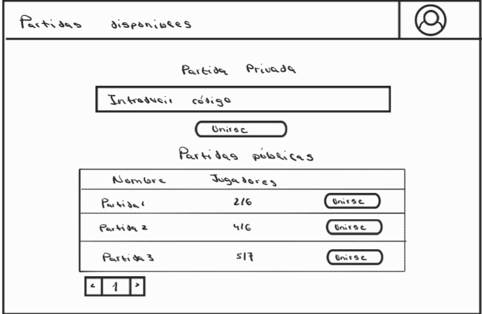|
|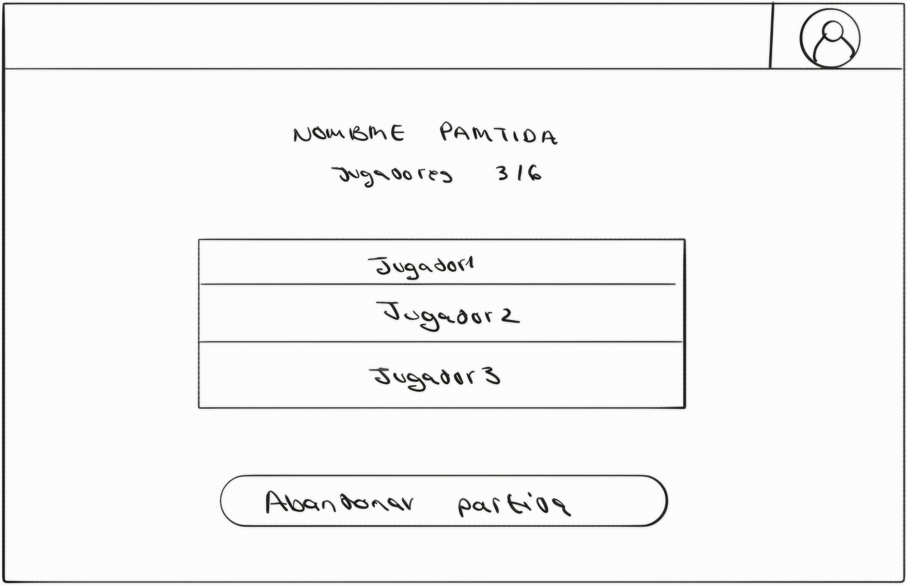|
|El jugador podra elegir unirse a una partida pública en la que aún haya espacio o unirse a una partida privada usando el código correspondiente de esa partida, después de unirse a alguna partida el sistema le llevará a una sala de espera con los jugadores que se vayan uniendo. El jugador podrá abandonar la partida usando el botón de abandonar. |

### HU-003
|Como jugador quiero robar el número de cartas de mi elección para poder gestionar mi Mano como quiera.| 
|-----|
|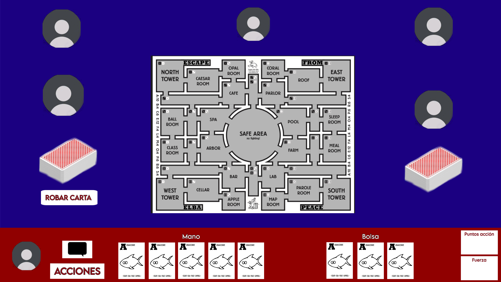|
|El jugador tiene la opción de robar las cartas que quiera o no robar ninguna usando el botón de robar cartas del mazo, sin embargo el total de cartas que tenga en su Mano después de robar no puede ser superior a 7. Esto se realiza al principio de cada turno del jugador. |

### HU-004
|Como jugador quiero elegir qué acción realizar si tengo puntos de acción para poder gastar esos puntos en acciones estratégicas.| 
|-----|
|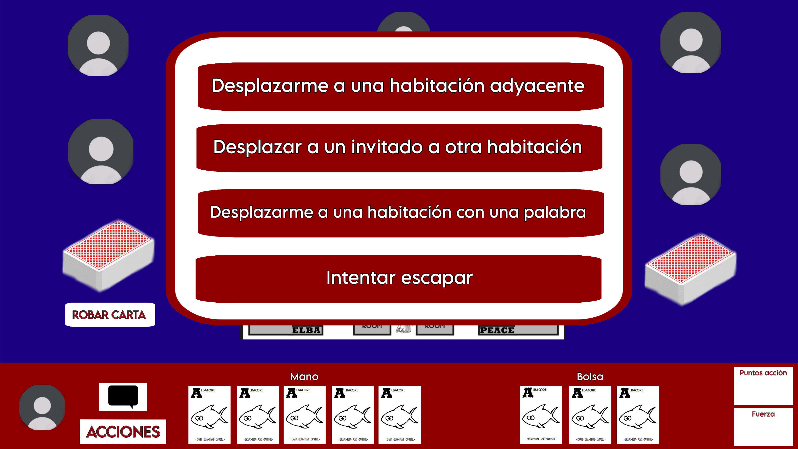|
|El jugador al terminar de robar cartas calculará su número de puntos de acción ( 7 - número de cartas de tu mano)  y si cuenta con puntos de acción el sistema le va a permitir ver las diversas opciones de acciones que puede realizar usando el botón de acciones. Puede desplazarse a una habitación adyacente, trasladar a un invitado a otra habitación, saltar a otra habitación si posee la palabra de esa habitación y puede hacer un intento de escape. |

### HU-005
|Como jugador quiero desplazarme a una habitación adyacente a la que me encuentro para iniciar un combate o para moverme a esa habitación. | 
|-----|
|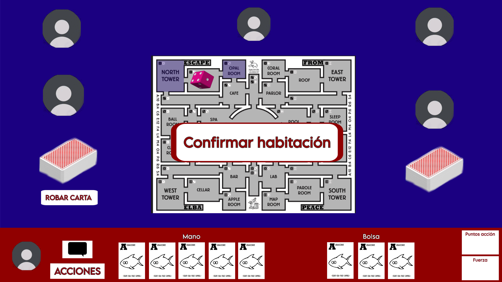|
|El jugador tras hacer el recuento de sus puntos de acción podrá elegir trasladarse a una habitación adyacente de su elección gastando un punto de acción, las habitaciones adyacentes al jugador aparecerán destacadas en el tablero y al pulsar alguna el sistema le hará confirmar su elección. Como consecuencia de esto podríamos terminar en un combate. |

### HU-006
|Como jugador quiero desplazar a otro invitado a otra habitación para iniciar un combate o alejarlo de escaparse. | 
|-----|
|Mockups (prototipos en formato imagen de baja fidelidad) de la interfaz de usuario del sistema|
|El jugador tras hacer el recuento de sus puntos de acción podrá elegir desplazar a Niall Campbell o a un no jugador, es decir, a aquellos jugadores considerados como NPCs, gastando un punto de acción. Esto también podría ocasionar combates. |

### HU-007
|Como jugador quiero desplazarme a una habitación en específico al formar la palabra de esa habitación para avanzar en la partida. | 
|-----|
|Mockups (prototipos en formato imagen de baja fidelidad) de la interfaz de usuario del sistema|
|El jugador tras hacer el recuento de sus puntos de acción si posee en su Bolsa una palabra de alguna habitación podrá usar esa palabra para desplazarse a la misma gastando un punto de acción, pudiendo ocurrir así un combate. |

### HU-008
|Como jugador quiero intentar escapar, ya sea estando en una torre o teniendo alguna de las dos palabras de escape fuerte para ganar la partida. | 
|-----|
|Mockups (prototipos en formato imagen de baja fidelidad) de la interfaz de usuario del sistema|
|El jugador tras hacer el recuento de sus puntos de acción podrá realizar un intento de escape si en su Bolsa posee una palabra de escape fuerte (EMPEROR o CAMPBELL), o si posee la palabra de alguna torre y se encuentra en esa misma torre. Si el jugador cumple alguna de esas condiciones deberá de lanzar un dado. Si el resultado es inferior a la fuerza del jugador su intento de escape sera existoso y habrá ganado, si por el contrario no es inferior el jugador será catapultado a una habitación aleatoria, perderá todos sus puntos de acción y a su fuerza se le sumará 1. |

### HU-009
|Como jugador voy a formar parte de un combate para poder subir mi fuerza. | 
|-----|
|Mockups (prototipos en formato imagen de baja fidelidad) de la interfaz de usuario del sistema|
|Cuando un jugador se desplaza a otra habitación y esa habitación ya está siendo ocupada por otro invitado se produce automáticamente un combate. Los jugadores deben de tirar un dado y sumar el resultado a su fuerza, también habría que sumar 1 punto si tienen alguna arma en su Bolsa, el jugador con el mayor resultado gana. Si son dos jugadores activos el ganador puede robar una carta a su elección de la Bolsa del perdedor o una al azar de su Mano, el perdedor será catapultado  a una habitación aleatoria, perderá todos sus puntos de acción y a su fuerza se le sumará 1.  Si un jugador activo vence a un no jugador la carta que robe será del mazo, si este no jugador es Niall la carta robada será la última del montón de descartes. Si un no jugador vence a un jugador activo el jugador activo debe descartar una carta de su Bolsa o Mano. |

### HU-010
|Como jugador quiero descartar las cartas que quiera de mi mano para poder llevarlas a mi Bolsa o al montón de descartes. | 
|-----|
|Mockups (prototipos en formato imagen de baja fidelidad) de la interfaz de usuario del sistema|
|El jugador tras haber realizado todas las acciones que haya querido si tiene 7 cartas o menos en su Mano podrá elegir  descartar el número de cartas de su Mano que él quiera mandandolas a su Bolsa, si el jugador tiene en su Mano más de 7 cartas es obligatorio que descarte cartas hasta quedarse con máximo 7 en su Mano. |

### HU-011
|Como jugador quiero formar una palabra para poder moverme a otra habitación o intentar escapar. | 
|-----|
|Mockups (prototipos en formato imagen de baja fidelidad) de la interfaz de usuario del sistema|
|El jugador después de realizar el descarte de cartas podrá intentar formar palabras con esas cartas y guardarlas en su bolsa para poder usarlas más adelante, si el jugador no es capaz de formar ninguna palabra con sus letras tendrá que mantener solo en su bolsa 2 cartas y las sobrantes irán al montón de descarte. Con esto termina el turno del jugador. |

### HU-012
|Como jugador quiero formar una palabra que represente un arma para aumentar mi fuerza en un combate. | 
|-----|
|Mockups (prototipos en formato imagen de baja fidelidad) de la interfaz de usuario del sistema|
|Si el jugador forma parte de un combate podrá usar una palabra que represente un arma para sumar un punto a su resultado. La palabra que represente el arma solo se podrá formar con las letras que tenga el jugador en la Bolsa en el momento del combate. No podrá usar cartas de su Mano. |

### HU-013
|Como jugador quiero poder formar una palabra que represente un arma y no se encuentre en la lista de armas. | 
|-----|
|Mockups (prototipos en formato imagen de baja fidelidad) de la interfaz de usuario del sistema|
|El jugador a la hora de formar un arma en un combate podrá formar una palabra que no se encuentre en la lista de armas dada con las cartas de la Bolsa en su turno (pero no podrá con las cartas de su Mano). |

### HU-014
|Como jugador quiero aceptar/rechazar la propuesta de arma de otro jugador. | 
|-----|
|Mockups (prototipos en formato imagen de baja fidelidad) de la interfaz de usuario del sistema|
|Cuando un jugador forme un arma que no pertenezca a la lista de armas proporcionada por el juego durante un combate , se abrirá una votación de forma que a cada uno de los jugadores restantes les aparecerá una ventana con la palabra formada por el jugador interesado junto con un botón de aceptar y otro de rechazar. Si hay mayoría en la votación se aceptará la palabra.En caso de que no sea aceptada el jugador tendra otros dos intentos para formar un arma. |

### HU-015
|Como jugador quiero ver el listado de partidas jugadas y creadas por mí para ver mi historial de juego. | 
|-----|
|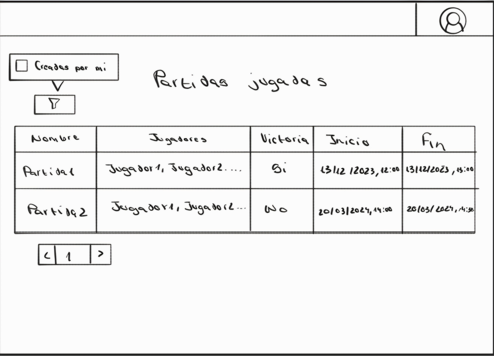|
|El sistema va a permitir al jugador ver un listado con todas sus partidas, incluyendo datos de la partida como el nombre, los jugadores, si ganó esa partida y la fecha en la que se inició y finalizó la partida. El jugador también tiene la opción de ver solo el listado de partidas que fueron creadas por él usando el botón de filtrado.|

### HU-016
|Como administrador quiero ver el listado de partidas en curso para tener información mas precisa. | 
|-----|
|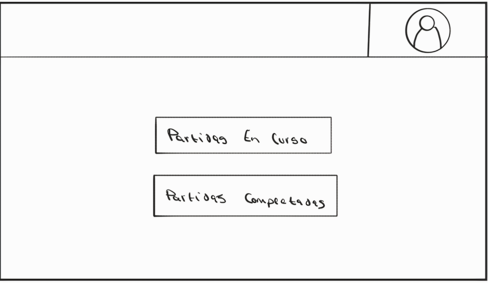|
|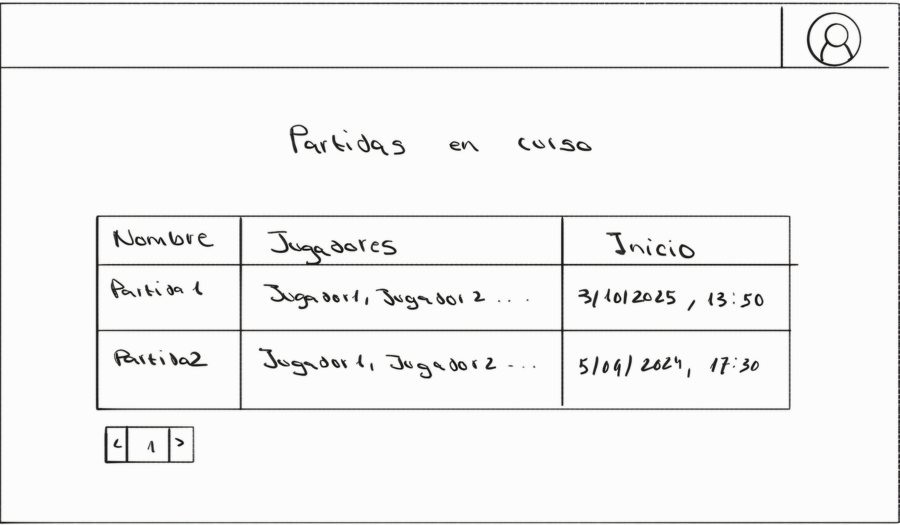|
|El administrador va a tener acceso a un listado de partidas que siguen en curso que el sistema le proporcionará al pulsar el botón. Este listado va a proporcionar el nombre de la partida, los jugadores y la fecha de inicio.|

### HU-017
|Como administrador quiero ver el listado de partidas jugadas y sus participantes para tener un registro de las partidas. | 
|-----|
|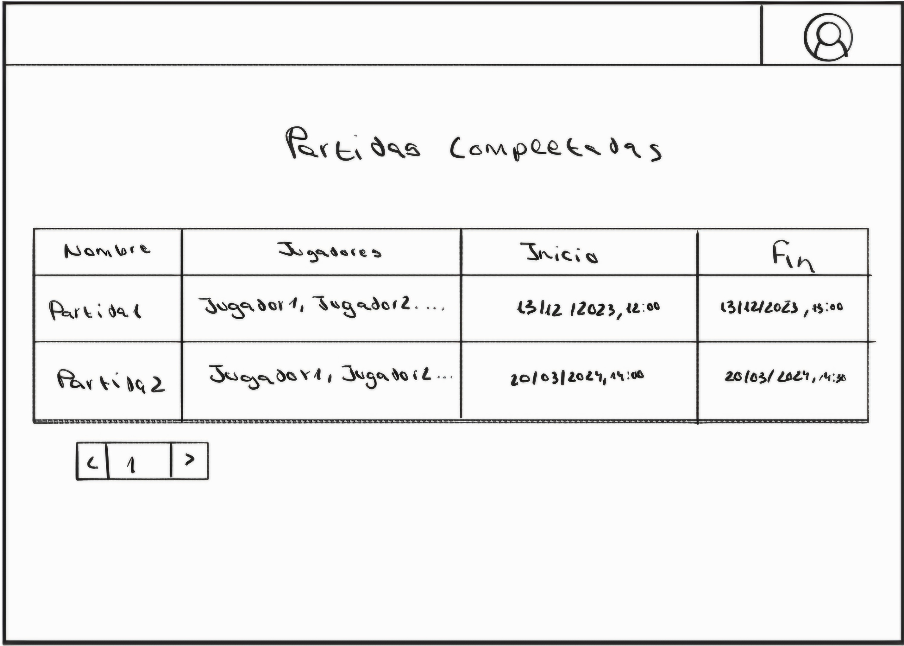|
|Mockups (prototipos en formato imagen de baja fidelidad) de la interfaz de usuario del sistema|
|El administrador va a tener acceso a un listado de partidas completadas que el sistema le proporcionará al pulsar el botón. Este listado va a proporcionar el nombre de la partida, los jugadores y la fecha de inicio y final de la partida.|

## Gestión de usuarios

### HU-018
|Como jugador quiero poder registrarme para poder acceder a las funcionalidades del juego.| 
|-----|
|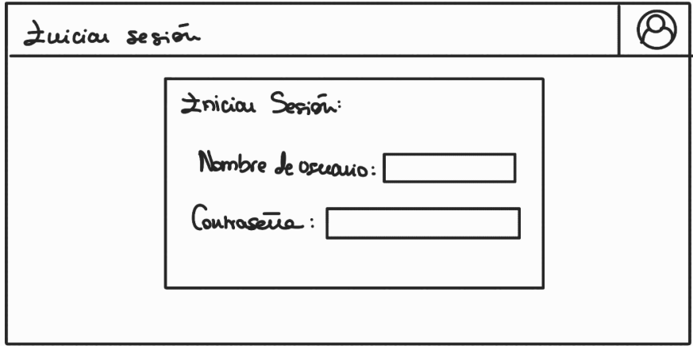|
|Cuando intentemos registrarnos introduciendo los datos obligatorios (nombre de usuario, contraseña y correo electrónico) el sistema creará un nuevo perfil para el jugador.|

### HU-019
|Como jugador quiero poder iniciar sesión para poder jugar a partidas.|
|-----|
|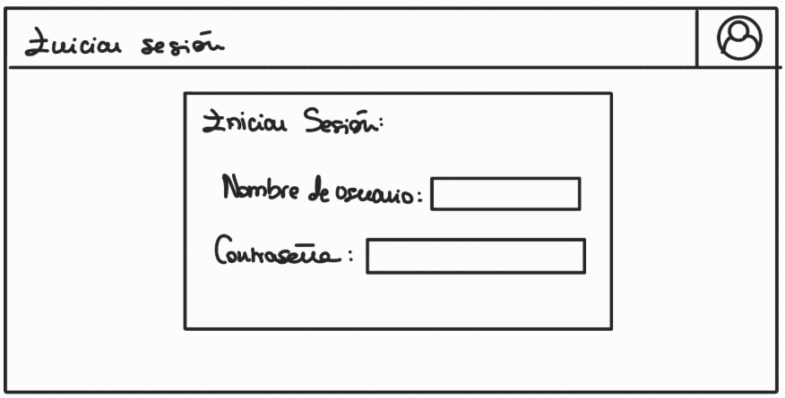|
|Cuando se inicie sesión con los campos obligatorios necesarios (nombre de usuario y contraseña), el sistema verificará las credenciales.|

### HU-020
|Como jugador quiero poder cerrar sesión para desconectar mi cuenta de forma segura.|
|-----|
|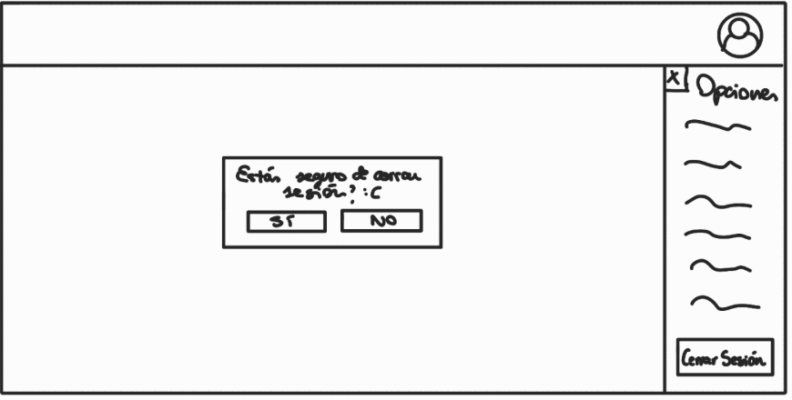|
|Cuando un jugador identificado pulse el menú desplegable podrá ver dentro un botón de cerrar sesión. Si hace click en él, aparecerá una ventana para que confirme que quiere desconectar su cuenta.|

### HU-021
|Como jugador quiero poder acceder al menú desplegable para poder visitar las diferentes partes del sistema.|
|-----|
|Ver mockup de la HU-020|
|El menú desplegable estará ubicado en la esquina superior derecha de la pantalla. Cuando el usuario haga click en él, podrá navegar a la pantalla que quiera.|

### HU-022
|Como jugador quiero poder consultar las reglas del juego para conocer sus normas y mecánicas.|
|-----|
|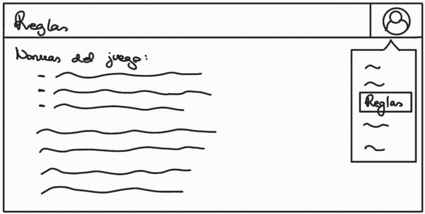|
|Cuando el usuario acceda al menú desplegable, podrá hacer click en “Reglas” donde podrá consultar todo lo necesario para conocer el funcionamiento y las normas del juego.|

### HU-023
|Como jugador quiero editar mi perfil personal para que mis datos estén actualizados.| 
|-----|
|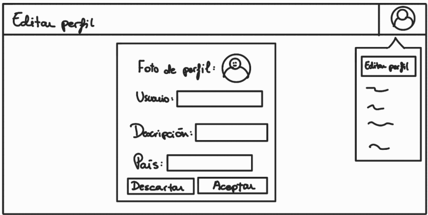|
|Cuando el usuario acceda al menú desplegable, podrá hacer click en un botón que le permitirá editar sus datos personales (foto de perfil, nombre de usuario, una breve descripción sobre él y su país).|

### HU-024
|Como administrador quiero ver un listado de usuarios registrados con paginación para saber quiénes son los jugadores.| 
|-----|
|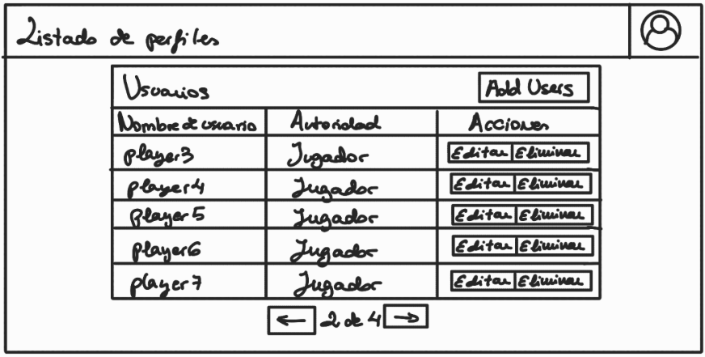|
|En la barra de navegación habrá un botón llamado "Listado de perfiles" que nos permitirá ver los jugadores registrados.|

### HU-025
|Como administrador quiero realizar operaciones CRUD sobre los usuarios para mantener actualizado el sistema, poder comprobar la seguridad, poder borrar en cascada partidas, estadísticas, etc.| 
|-----|
|Ver mockup de la HU-024|
|Al pulsar en los botones “Editar” o “Eliminar” el sistema completará la acción correspondiente.|

## Estadísticas 

### HU-026
|Como jugador quiero poder ver el número de partidas jugadas para observar estadísticas                                                                    | 
|-----|
|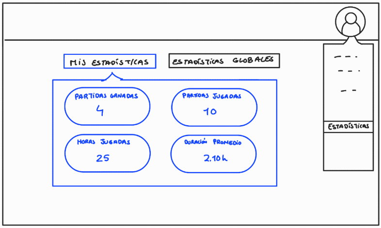|
|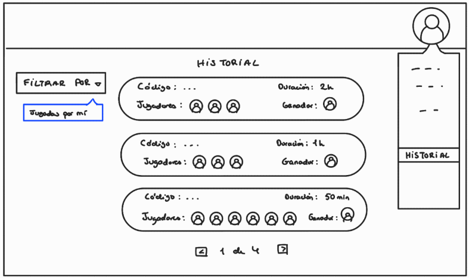|
|En la pantalla de “Estadísticas”, si el usuario está registrado, aparecerán dos botones: uno para ver las métricas del usuario y otro para las métricas globales de todo el juego. Si desea ver más detalles aparte del número exacto de partidas jugadas, puede desplazarse a la pantalla de “Historial”, en la que aparecen listadas todas las partidas. El usuario puede filtrar este historial por si desea solo ver los detalles de las partidas en las que él haya sido partícipe.|

### HU-027
|Como jugador quiero poder ver la duración de las partidas jugadas para saber si dispongo del tiempo necesario| 
|-----|
|Ver mockup de la HU-026|

### HU-028
|Como jugador quiero poder ver el número de jugadores por partida jugada para observar estadísticas                                                     | 
|-----|
|Ver mockup de la HU-026|
|El usuario en la pantalla de “Historial” puede ver cada partida jugada junto detalles como los jugadores implicados. Además puede filtrar ese listado y mostrar solo sus partidas. |

### HU-029
|Como jugador quiero poder ver estadísticas y métricas del juego para hacer un seguimiento de mi rendimiento |
|-----|
|Ver mockup de la HU-026|

### HU-030
|Como jugador quiero poder ver un ranking de jugadores para fomentar mi competitividad| 
|-----|
|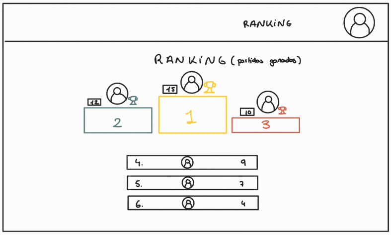|
|En la barra de navegación hay un atajo llamado “Ranking”. Cuando se clica se muestra una pantalla en la que salen los 3 jugadores con más victorias. Justo debajo se encuentra el listado de jugadores en orden de victorias descendente. La posición del usuario en el ranking sale resaltada. |

### HU-031
|Como jugador quiero poder ver mis logros en mi perfil para ver cómo avanzo en el juego | 
|-----|
|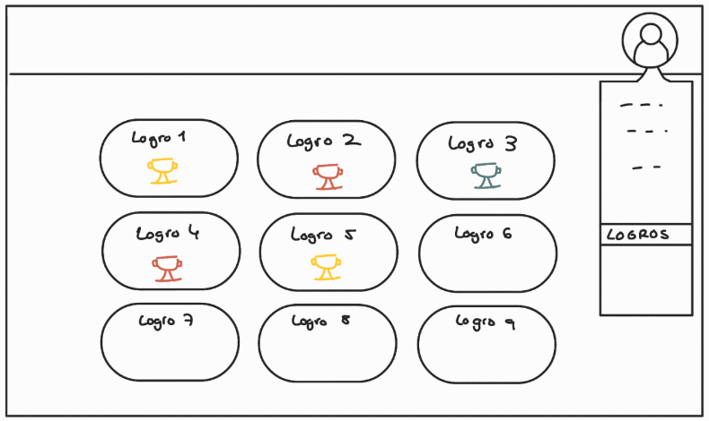|
|En la pantalla de “Mis logros” se mostrarán todos los logros desbloqueados por el jugador. Aquellos no conseguidos se mostrarán menos resaltados. |

### HU-032
|Como administrador quiero poder editar los logros para adaptarlos a nuevos criterios | 
|-----|
|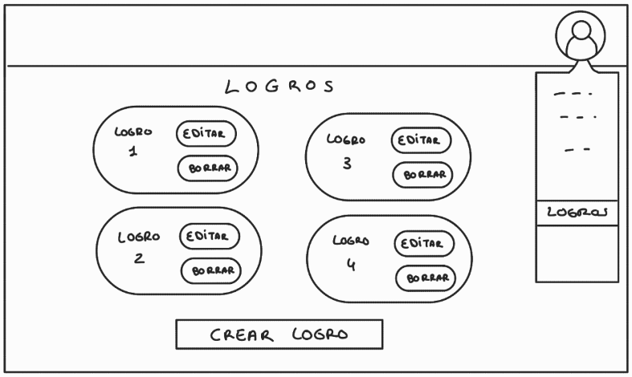|
|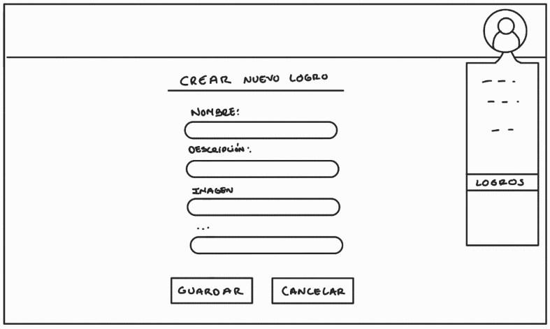|
|Cuando el usuario como administrador al acceder a la pantalla de “Logros”, le aparecen cada logro junto con dos botones: uno para editarlo y otro para eliminarlo. Si se desea crear un nuevo logro, se deberá pulsar en el botón de “Crear logro” que llevará a otra pantalla en la que se rellenarán los datos necesarios para su creación. Para guardarlo se pulsará en el botón de “Guardar” y para cancelar en el de “Cancelar”. |

## Juego social

### HU-033
|Como jugador quiero enviar, gestionar y recibir invitaciones de amistad para poder jugar juntos.| 
|-----|
|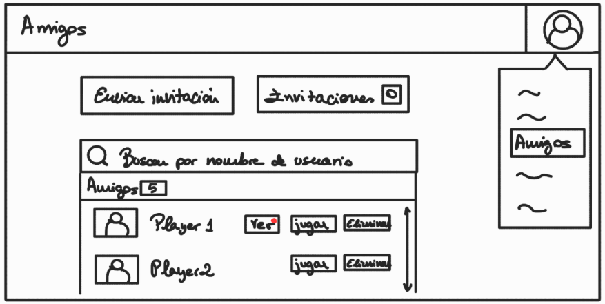|
|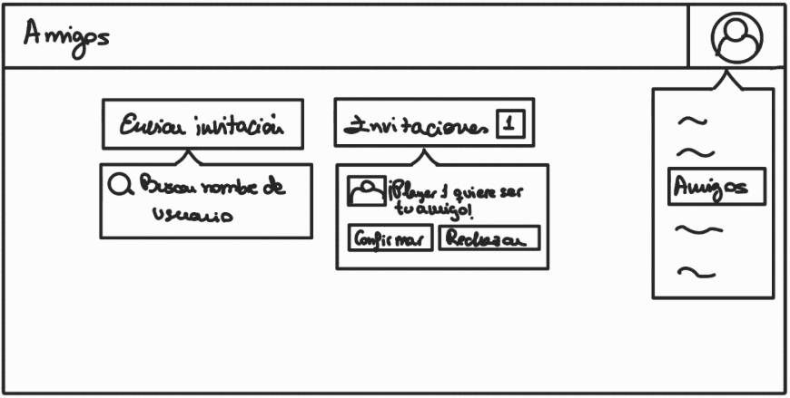|
|Cuando el jugador pulse el botón “Amigos” dentro del menú desplegable, irá a una pantalla donde podrá buscar a un amigo por su nombre de usuario y podrá eliminarlo o invitarlo a jugar. También en el botón “enviar una invitación” podrá añadir nuevos amigos buscando su nombre de usuario. Por último, podrá ver las invitaciones de amistad en el botón “Invitaciones” que tendrá un contador de estas.|

### HU-034
|Como jugador quiero enviar y recibir invitaciones a partidas (bien en modo jugador o en modo espectador) para poder ver el juego o jugar.| 
|-----|
|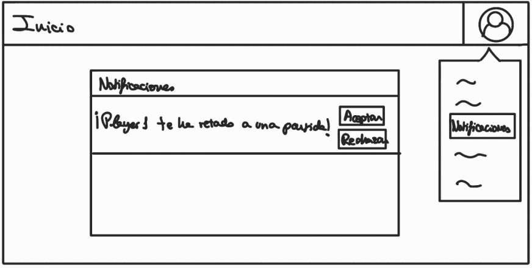|
|Cuando el jugador acceda al menú desplegable, podrá hacer click en “Notificaciones” donde podrá ver las invitaciones que ha recibido. Para enviar invitaciones a partidas consultar el mockup de la HU-032.|

### HU-035
|Como jugador quiero acceder con modo espectador a partidas de mis amigos para ver como juegan sin necesidad de participar.| 
|-----|
|Ver mockup de la HU-032.|
|En la pantalla de "Amigos", a la que podemos acceder a través del menú de navegación, aparecerá un botón "Ver" cuando un amigo esté en partida. Si hacemos click podremos ver la partida en modo espectador. Este botón desaparecerá si el amigo no está en partida.|

### HU-036
|Como jugador quiero escribir y leer comentarios en un chat durante las partidas para poder comunicarme con los demás jugadores.| 
|-----|
|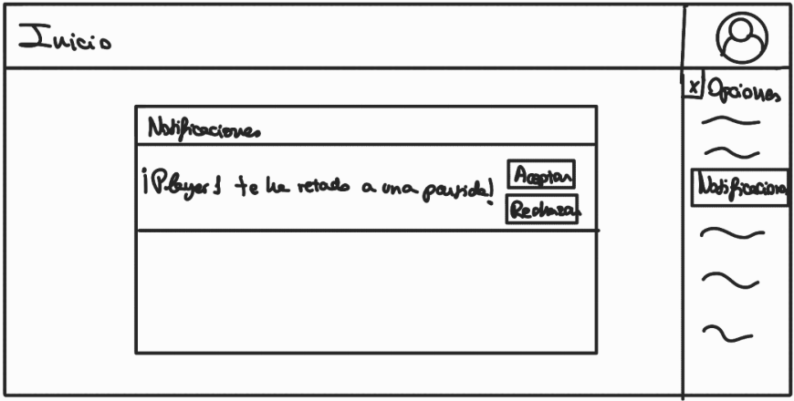|
|Cuando el jugador esté en partida podrá hacer click en el botón de chat (un bocadillo de conversación con tres puntos) para escribir y leer los comentarios de los demás jugadores.| 

## Diagrama conceptual del sistema

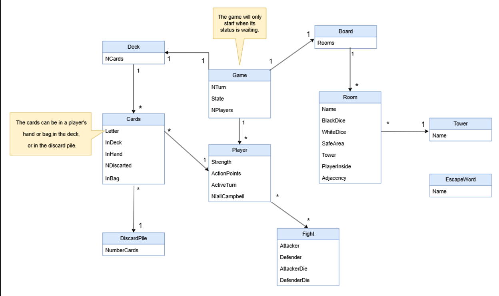

## Reglas de Negocio
### R1 - Número de jugadores
En cada partida debe asegurarse un mínimo de 3 jugadores y un máximo de 6 jugadores, y a cada jugador se le reparten 3 cartas.

### R1.1 - Más de 6 jugadores
Si se desea jugar con más de 6 jugadores, se reparten solo 2 cartas iniciales.

### R2 - Condiciones para ganar
Para que un jugador pueda considerarse ganador, deberá cumplir los siguientes 3 requisitos.

### R2.1 - Posesión de palabra de escape
El jugador deberá tener en su Bolsa una palabra válida de escape (ESCAPE, FROM, ELBA, PEACE, EMPEROR o CAMPBELL).

### R2.2 - Ubicación correspondiente
Las palabras de escape ESCAPE, FROM, ELBA y PEACE solo podrán utilizarse en la torre correspondiente, excepto EMPEROR y CAMPBELL, que permiten escapar desde cualquier sitio.

### R2.3 - Tirada inferior a Fuerza
El jugador deberá tirar su dado y obtener una tirada inferior a su fuerza actual.

### R3 - Gestión de cartas
El jugador deberá cumplir una serie de requisitos en cuanto a la gestión de las cartas en cada turno.

### R3.1 - Robo
La mano de 7 es un límite de robo, no de posesión; está permitido terminar el turno con más de 7 si efectos de combate lo provocan, pero nunca se puede robar por encima de 7 en el paso de robo.

### R3.2 - Limitaciones Bolsa
La Bolsa solo puede contener una palabra en inglés de 3 o más letras, o un máximo de 2 letras sueltas si no es capaz de formar una palabra. En caso de ser nombres propios solo se admitiran "CAMPBELL" y "ELBA".

### R3.3 - Cartas descartadas
Las cartas descartadas van al montón de descarte.
   
### R4 - Ganar puntos de acción
En cada turno, un jugador puede ganar puntos de acción en función del número de cartas que tenga en su mano tras robar. Si tiene 7 o más cartas, no gana ningún punto de acción. Si tiene menos de 7 cartas, gana puntos de acción igual a 7 menos el número de cartas en su mano.
Puntos = 7 - Número de cartas en mano.

### R5 - Usos de los Puntos de acción
Los puntos de acción ganados en un turno pueden ser usados para realizar las siguientes acciones:

### R5.1 - Moverse a una habitación adyacente
Un jugador puede gastar 1 punto de acción para moverse a una habitación adyacente a la suya.

### R5.2 - Mover a un jugador visitante NPC
Un jugador puede gastar 1 punto de acción para mover a un jugador visitante NPC a una habitación, esto puede provocar una batalla si la habitación ya está ocupada.

### R5.3 - Saltar a una habitación
Un jugador puede gastar 1 punto de acción para saltar a una habitación si puede formar el nombre de la habitación con las cartas en su bolsa.

### R5.4 - Intento de escape
Un jugador puede gastar 1 punto de acción para hacer un intento de escape si está en una de las torres de escape y puede formar su nombre o una de las palabras especiales con las cartas en su bolsa.

### R6 - Combates
Existen una serie de requisitos en cuanto a los combates

### R6.1 - Obligatoriedad de combate
Cada vez que un jugador entra en una sala ocupada, se formará un combate (Excepto en la Zona Segura o entre 2 NPCs)

### R6.2 - Catapulta
Si un jugador es catapultado a una sala ocupada, se deberá iniciar inmediatamente un nuevo combate, incluso si esto ocurre varias veces consecutivas. Si se cae en la misma sala se pelea de nuevo. (La sala a la que se es catapultado se elegirá aleatoriamente mediante tirada de dados)

### R6.3 - Incremento de Fuerza del personaje
Cada derrota aumenta la Fuerza del perdedor en +1, un jugador nunca puede superar un nivel de Fuerza superior a 6.

### R6.4 - Empates
En caso de empate, el atacante ganará automáticamente.

### R6.5 - Victoria
El personaje con mayor fuerza es quien gana la batalla, esta fuerza se calcula con la fuerza que tengamos más la tirada del dado, de forma opcional se pueden usar armas si se tienen en la bolsa que suman 1 punto de fuerza cada una.

### R6.5.1 - Victoria contra otro jugador
Si el jugador gana la batalla contra otro jugador, podrá elegir entre robar una carta aleatoria de su mano o una carta de su bolsa.

### R6.5.2 - Victoria contra Niall Campbell
Si el jugador gana la batalla contra Niall Campbell, podrá robar la carta superior del mazo de descarte.

### R6.5.3 - Victoria contra un NPC
Si el jugador gana la batalla contra un NPC, podrá robar una carta del mazo de robo.

### R6.6 - Derrota
El jugador que pierde la batalla sera catapultado, ganara 1 de fuerza (maximo 6) y dependiendo de contra quien pierda, se aplicaran las siguientes reglas:

### R6.6.1 - Derrota contra otro jugador
Si el jugador pierde la batalla contra otro jugador, pierde la carta que el ganador elija, ya sea de su mano o de su bolsa y perdera todos los puntos de acción restantes.

### R6.6.2 - Derrota contra NPC
Si el jugador pierde la batalla contra un NPC, pierde una carta a eleccion de su mano o bolsa.

### R7 - Fallo en Escape
Un intento de escape fallido implicará: ser lanzado a una sala aleatoria, perder todos los puntos de acción restantes, ganar 1 de fuerza (Máximo 6) y descartar una carta de elección propia.

### R8 - Posicion inicial de Campbell
Niall Campbell siempre comienza la partida en la Zona Segura.

### R9 - Partida unica
Cada jugador solo puede estar en una partida a la vez.

### R10 - Dados
Cada jugador juega con un dado de 6 caras, mientras que Niall Campbell juega con un dado especial llamado "Master die" tambien de 6 caras pero diferenciable por su color.

### R11 - Habitaciones de inicio
Cada jugador comienza la partida en una habitación determinada por la tirada de dos dados (uno negro y otro blanco). Si un jugador queda ubicado en una habitacion ocupada, este tirara de nuevo.

### R12 - Distribucion predefinida
Se juega con un total de 64 cartas.

### R13 - Barajar y remezclar
Cuando el mazo de robo se agota, se baraja inmediatamente el descarte para formar un nuevo mazo y se continúa robando sin pausa en el mismo paso de juego.

### R14 - Jugador inicial
Se escoge mediante azar el jugaor con tirada de dados mas alta y se siguen los turnos de manera descendente, en caso de empate repiten la tirada solo los empatados.

### R15 - Flujo de cartas estricto
Las cartas pasan de la mano a la Bolsa y de esta al mazo de descartes, nunca en sentido inverso salvo por efectos de botín de combate o robos del mazo de robo/descarte definidos; está prohibido pasar del descarte a la bolsa o mano sin un evento de juego que lo permita.

### R16 - Orden del turno
Durante el turno se sigue el orden de 1º robar, 2º tomar accion y por ultimo descartar, y es imposible volver a la fase anterior en caso de avanzar.
