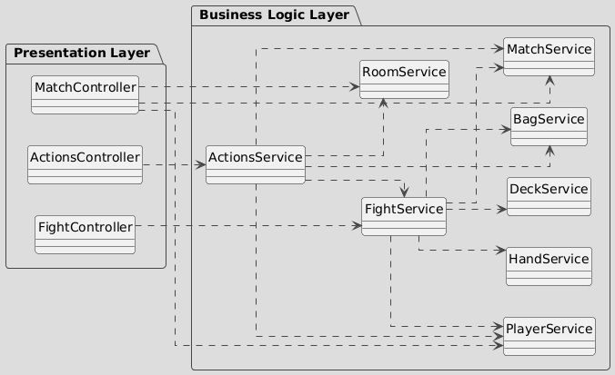
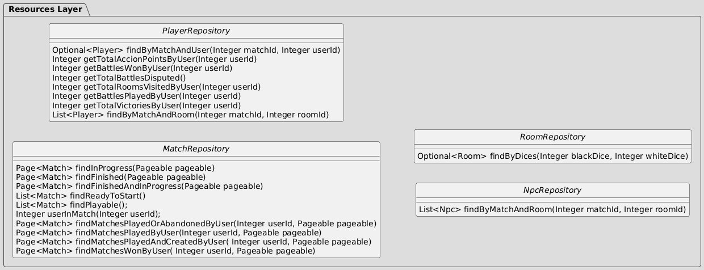
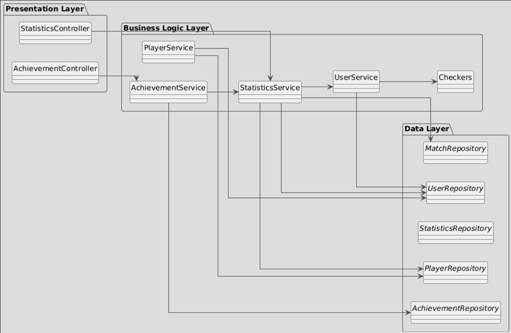
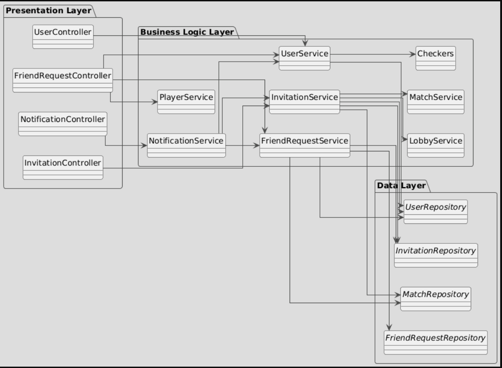
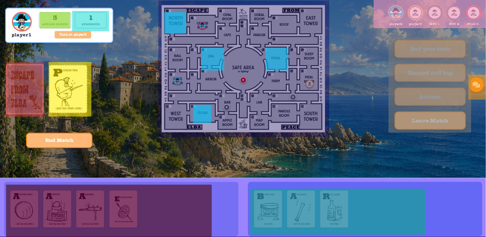

# Documento de diseño del sistema
**Asignatura:** Diseño y Pruebas (Grado en Ingeniería del Software, Universidad de Sevilla) 

**Curso académico:** 2025/2026

**Grupo/Equipo:** L2-01

**Nombre del proyecto:** Escape From Elba 

**Repositorio:** https://github.com/laucss/dp1-2025-2026-l2-01-julio.git

**Integrantes :**

Nerea Camacho Perez (QFL3393 / nercamper@alum.us.es) 
Laura Cubero Sánchez (XNT3290 / laucubsan@alum.us.es) 
Lucía Baltasar Muñoz (SBJ4592 / lucbalmun@alum.us.es) 

## Introducción

Este proyecto se dedica a la implementación del juego de mesa llamado "Escape From Elba" de 1999, el cual por cada partida puede ser disfrutado desde 3 a 6 jugadores, con una duración media de 60 minutos. 

### Materiales
Los materiales para jugar son muy simples, ya que se componen principalmente de dos:

- El tablero, el cual está formado por un distinto número de habitaciones, en cada una aparece su nombre (lo cual será importante para una de las mecánicas principales del juego) y dos dados, uno negro y otro blanco (los cuales servirán para colocar a los jugadores en habitaciones aleatorias).

- Las cartas, en las cuales destacan dos partes esenciales. La primera letra del nombre de la carta, situada en la esquina superior izquierda y el conjunto de palabras de escape que se puede formar con esta letra.

 
### Objetivo
La partida comienza colocando a los visitantes, para esto cada uno lanza dos dados, uno negro y otro blanco, colocando a su personaje en la habitación que estos indiquen. Posteriormente se reparten 3 cartas a cada jugador (si deseas jugar con más de 6 jugadores, se recomienda repartir solo 2 cartas iniciales) y se elige a un jugador de manera aleatoria para que este comience, siendo el siguiente el de su izquierda.
El ojetivo trata de obtener un conjunto de cartas, ya sea robando del mazo o de otros jugadores, las cuales te permitan escapar, cada carta represnenta una letra (cada una muestra todas las palabras del juego en las que se encuentra), también puedes tener cartas boca arriba sobre la mesa las cuales se considerarán como tu "bolsa", estas cartas son las que te permitirán formar palabras que te ayuden a escapar, luchar y moverte por los alrededores. Para escapar es necesario ganar fuerza (todos los jugadores empiezan con 1 de fuerza), la cual se consigue haciendo batallas contra otros jugadores.

### Batallas
El jugador que entra a una habitación ya ocupada siempre será considerado como el atacante (en caso de empate, contará como victorioso), ambos jugadores lanzan un dado y se le suma sus puntos de fuerza (también es posible utilizar armas si puedes formarlas con la palabra de tu "bolsa"). Si pierdes la batalla contra otro jugador ganas fuerza (se descarta una carta a su elección de la mano o de la "bolsa" si es contra Niall Campbell). Sin embargo, si ganas contra otro jugador puedes elegir entre robar una carta de su "bolsa" o una aleatoria de su mano (la carta superior del mazo de descarte si es contra Niall Cambell o una del mazo de robo si es contra cualquier otro visitante NPC).

### Turnos
El primer paso es robar cartas, puedes robar cuantas cartas quieras hasta alcanzar 7 cartas en tu mano (dependiendo de cuantas cartas tengas afectará a los puntos de acción de tu turno). Si tienes 7 o más cartas, no recibes ningún punto de acción, si tienes menos, recibes 7 menos el número de cartas en tu mano, por ejemplo si tienes 5 cartas, obtienes 2 puntos. 

Puedes gastar tus puntos en diferentes acciones: 
- Moverte a una habitación adyacente a la tuya. 
- Mover a un jugador visitante NPC a una habitación adyacente a la suya. 
- Saltar a una habitación si eres capaz de formar algun nombre de alguna habitación con la palabra de tu "bolsa", por ejemplo si tienes "APPEARS", puedes dirigirte a "**SPA**" o a "SAFE **AREA**" (si es una palabra compuesta solo debes formar una de las palabras que la componen). Siempre y cuando no sea una torre de escape. 
- Hacer un intento de escape, siempre que estes en una de las torres de escape (a no ser que sea "EMPEROR" o "CAMPBELL", cuyas palabras pueden usarse en cualquier ubicación), puedas formar su nombre con la palabra en tu "bolsa". Para que el intento sea exitoso, debes lanzar un dado y sacar un número inferior a tu fuerza. Si el intento es fallido, se lanzna los dados para moverte a una habitación aleatoria. 
- Por ultimo, puedes descartarte de tantas cartas como quieras y debes vaciar tu mochila, quedandote con 2 letras o 3 si eres capaz de formar una palabra con estas.

### Vídeo explicativo de las normas de Escape From Elba
[https://youtu.be/JjQOi04i2-0?si=LMb-skomsHNsHqmz]

## Diagrama(s) UML:

### Diagrama de Dominio/Diseño

Debido al gran tamaño del trabajo realizado se han realizado varios diagramas de diseño por bloques.

#### Diagrama base

#### Diagrama del módulo de juego

#### Diagrama de las cartas

#### Diagrama del módulo social

#### Diagramas de DTOS

### Diagrama de Capas (incluyendo Controladores, Servicios y Repositorios)

Con objeto de facilitar la comprensión se han dividido y diseccionado en varios diagramas. 

## Descomposición del mockups del tablero de juego en componentes

Componentes de la pantalla de juego principal:

  - App – Componente principal de la aplicación
    - $\color{pink}{\textsf{PlayersAvatar – Muestra los avatares de los N jugadores de la actual partida.}}$
    - $\color{darkblue}{\textsf{Map – Área de juego principal.}}$
       - $\color{blue}{\textsf{Rooms – Conjunto de habitaciones que hay en el mapa.}}$
    - $\color{yellow}{\textsf{DiscardPile – Muestra el mazo de cartas de descarte.}}$
    - $\color{red}{\textsf{Deck – Muestra el mazo de cartas de robo.}}$
   
    - $\color{purple}{\textsf{PlayerInformation – Muestra toda la información relevante sobre tu partida personal, como las cartas en tu poseson (mano o bolsa), tus puntos de fuerza y de acción, un boton para elegir tu acción y el botón del chat.}}$
       - $\color{orange}{\textsf{ChatButton – Boton para abrir el chat}}$
       - $\color{gray}{\textsf{ActionsButton – Boton para abrir el menu de acciones disponibles en tu ronda.}}$
       - $\color{darkred}{\textsf{HandCards - Muestra un listado de tus cartas en la mano.}}$
       - $\color{darkgreen}{\textsf{BagCards – Muestra un listado de tus cartas en la bolsa. }}$
       - $\color{green}{\textsf{ActionPoints – Muestra los puntos de acción disponibles en tu ronda.}}$
       - $\color{cyan}{\textsf{Strength – Muestra tus puntos de fuerza actuales.}}$

## Patrones de diseño y arquitectónicos aplicados

### Patrón: Modelo-Vista-Controlador(MVC)
*Tipo*: de Diseño

*Contexto de Aplicación*

La aplicación tiene diferentes secciones estructuradas siguiendo el patrón MVC, dividiendo su funcionalidad en varias capas bien diferenciadas: entidades del modelo, repositorios, servicios y controladores. El framework Spring fomenta esta organización.

*Clases o paquetes creados*

 -Models
 -Repositories
 -Services
 -Controllers

*Ventajas alcanzadas al aplicar el patrón*

La aplicación del patrón MVC permite una clara separación entre la lógica de negocio (capa service), las entidades y acceso a datos (capas models y repositories) y la comunicación con el frontend (capa controller). Esta división mejora la organización del proyecto, facilita el trabajo en equipo y optimiza el mantenimiento y la evolución del sistema.

### Patrón: Dependency Injection
*Tipo*: de Diseño

*Contexto de Aplicación*

La aplicación delega la creación de dependencias, objetos que una clase necesita para funcionar, a un contenedor externo en lugar de que la propia clase las cree directamente. En Spring Boot, esto lo hace el contenedor de Spring, que se encarga de instanciar e inyectar los objetos (beans) necesarios en cada clase

*Clases o paquetes creados*

La inyección de dependencias se aplica a través de anotaciones de Spring ya que esta integrado directamente en el framework de Spring Boot por lo que no ha sido necesaria la creación de clases o paquetes para este patrón. 

*Ventajas alcanzadas al aplicar el patrón*

La aplicación del patrón Dependency Injection facilita cambiar las dependencias sin tener que modificar el código principal ya que las clases no dependen de implementaciones concretas, sino de interfaces o abstracciones. Permite también la alta reutilización y mantenebilidad ya que es posible modificar la lógica de una clase sin tocar el servicio que la usa. Por otro lado, también se consigue un código más limpio y organizado.

### Patrón: Data Transfer Object (DTO)
*Tipo*: de Diseño

*Contexto de Aplicación*

La aplicación para evitar exponer datos internos de algunas clases relacionados con la base de datos interna a la hora de transportar la información de una capa a otra utiliza varios objetos DTO para realizar esta transferencia.

*Clases o paquetes creados*

-CardDTO
-HandInGameDTO
-BagInGameDTO
-DeckInGameDTO
-AllCardsStatusDTO
-DrawCardResultDTO
-DiceTotalsUpdateDTO
-FightDiceUpdateDTO
-FightResolvedDTO
-FightResultRequestDTO
-FightUpdateDTO
-LoseAgainstNpcRequestDTO
-ReadyStateUpdateDTO
-StealCardRequestDTO
-WeaponsUpdateDTO
-FriendsInvitationDTO
-MiniRequestDTO
-InviteRequest
-PlayerPositionDTO
-NpcPositionDTO
-LobbyDTO
-LobbyUpdateDTO
-PlayerLobbyDTO (clase interna)
-UserLobbyDTO (clase interna)
-MatchDTO
-MatchHistorialDTO
-ActionPointsUpdateDTO
-CardsUpdateDTO
-EndedMatchDTO
-EscapeAttemptResultDTO
-HandUpdateDTO
-MoveNpcToRoomDTO
-MoveToRoomDTO
-NpcLocationUpdateDTO
-PlayerLocationUpdateDTO
-StrengthUpdateDTO
-TurnUpdateDTO

*Ventajas alcanzadas al aplicar el patrón*

La aplicación del patrón Data Transfer Object protege la lógica interna de la aplicación y evita exponer campos sensibles, el frontend al no depender directamente de las entidades del backend gracias a esto favorece el bajo acoplamiento entre capas. Otra ventaja es la optimización de la transferencia de datos ya que se reduce el tamaño de las respuestas al enviar solo los datos necesarios.

### Patrón: Prototype
*Tipo*: de Diseño 

*Contexto de Aplicación*
Usamos este patrón sobre todo al iniciar elementos de la partida como en nuestra caso, la baraja. Al iniciar una partida se coge cada carta de la baraja original almacenada y se hace una copia de ella, para formar una baraja completa copiada. 

*Clases o paquetes creados*
-paquete patterns 
-clase Prototype.java
 

*Ventajas alcanzadas al aplicar el patrón*
Conseguimos crear copias exacta de una entidad de forma sencilla. 

### Patrón: Domain Model
*Tipo*: Arquitectónico

*Contexto de Aplicación*
Al diseñar el backend, lo planteamos como un sistema compuesto por diversas entidades que se relacionan entre sí.

*Clases o paquetes creados*
·Cards
   -bag
      -bag
      -bagInGame
   -deck
      -deck
      -deckInGame
   -hand
      -hand
      -handInGame
   -card
.Fights
   -pendingFight
.Invitations
   -invitationMatch
.Notification
   -notification
·Chat
   -chatMessage
·FriendRequest
   -friendRequest
·Match
   -lobby
   -match
·Npcs
   -npc
·Players
   -player
·Room
   -room
·Statistics
   -achievements
      -achievement
   -statistics
·User
   -user
·Util
   -checkers
.Voting
   -vote

*Ventajas alcanzadas al aplicar el patrón*
Aunque el tamaño de nuestro proyecto ha dado lugar a un modelo relativamente complejo, el uso de este patrón nos ha facilitado comprender de forma más clara cómo los cambios de estado en unas entidades influyen sobre otras.

### Patrón: Pagination
*Tipo*: de Diseño 

*Contexto de Aplicación*
A la hora de listar diversos recursos en nuestra aplicación, este listado se ha organizado de manera que se vayan cargando un número pequeño de datos y el usuario vaya pasando para ver los demás.

 
*Ventajas alcanzadas al aplicar el patrón*
Conseguimos optimizar las consultas sobre colecciones potencialmente grandes, reduciendo el tiempo de respuesta del servidor, el consumo de memoria y el volumen de datos enviados al cliente. Además, esta solución mejora la escalabilidad de la aplicación y facilita la navegación del usuario por grandes conjuntos de información.

## Decisiones de diseño

### Decisión 1: Importación de datos reales para demostración
#### Descripción del problema:

Como grupo nos gustaría poder hacer pruebas con un conjunto de datos reales suficientes, porque resulta más motivador. El problema es al incluir todos esos datos como parte del script de inicialización de la base de datos, el arranque del sistema para desarrollo y pruebas resulta muy tedioso.

#### Alternativas de solución evaluadas:

*Alternativa 1.a*: Incluir los datos en el propio script de inicialización de la BD (data.sql).

*Ventajas:*  
•	Simple, no requiere nada más que escribir el SQL que genere los datos.  
*Inconvenientes:*  
•	Ralentiza todo el trabajo con el sistema para el desarrollo.  
•	Tenemos que buscar nosotros los datos reales  

*Alternativa 1.b*: Crear un script con los datos adicionales a incluir (extra-data.sql) y un controlador que se encargue de leerlo y lanzar las consultas a petición cuando queramos tener más datos para mostrar.  
*Ventajas:*  
•	Podemos reutilizar parte de los datos que ya tenemos especificados en (data.sql).  
•	No afecta al trabajo diario de desarrollo y pruebas de la aplicación  
*Inconvenientes:*  
•	Puede suponer saltarnos hasta cierto punto la división en capas si no creamos un servicio de carga de datos.  
•	Tenemos que buscar nosotros los datos reales adicionales  

*Alternativa 1.c*: Crear un controlador que llame a un servicio de importación de datos, que a su vez invoca a un cliente REST de la API de datos oficiales de XXXX para traerse los datos, procesarlos y poder grabarlos desde el servicio de importación.

*Ventajas:*  
•	No necesitamos inventarnos ni buscar nosotros lo datos.  
•	Cumple 100% con la división en capas de la aplicación.  
•	No afecta al trabajo diario de desarrollo y pruebas de la aplicación  
*Inconvenientes:*  
•	Supone mucho más trabajo.  
•	Añade cierta complejidad al proyecto  

*Justificación de la solución adoptada*  
Como consideramos que la división en capas es fundamental y no queremos renunciar a un trabajo ágil durante el desarrollo de la aplicación, seleccionamos la alternativa de diseño 1.c.

### Decisión 2
#### Descripción del problema:

Hemos decidido implementar en nuestra aplicación cuando te unes a una partida una sala de espera hasta que se de por empezado el propio juego. El crear una sala de espera trata los mismos datos que una partida pero maneja una logica diferente por lo que tuvimos que pensar como lo ibamos a organizar.

#### Alternativas de solución evaluadas:

*Alternativa 2.a* : Añadir la lógica de negocio del lobby en el propio MatchService 
*Ventajas:*  
•	Una clase que gestiona todo, lobbies y partidas, hace que sea más simple.  
•	Hay menos servicios que implementar. 
•	No se necesita coordinación entre distintos servicios. 
*Inconvenientes:*  
• La lógica de lobby y de partida se mezcla, lo que hace que la clase sea más grande y difícil de mantener. 
• Añadir nuevas funcionalidades de lobby afecta directamente a la lógica de la partida. 
• Difícil de testear de forma aislada. 

*Alternativa 2.b* : Crear un servicio LobbyService para gestionar la lógica. 
*Ventajas:* 
•	Hace el código más fácil de entender, mantener y testear. 
•	Se separan las responsabilidades. 
•	Permite añadir funcionalidades específicas del lobby sin tocar la lógica de partidas. 
*Inconvenientes:* 
• Más código y más estructura que mantener. 
• Hay que pasar datos de LobbyService a MatchService cuando se inicia la partida. 

#### Justificación de la solución adoptada

Consideramos que es más importante usar la opción que nos permita separar las responsabilidades ya que es un proyecto que vamos a ir actualizando y añadiendo código por lo que es mejor que los cambios que hagamos no afecten a toda una partida, por eso hemos decidido crear el servicio LobbyService.

### Decisión 3
#### Descripción del problema:

A la hora de construir los services nos hemos visto con una gran cantidad de validaciones que comprobar por lo que hemos tenido que decidir cual sería la mejor manera de implementar estas validaciones.

#### Alternativas de solución evaluadas:

*Alternativa 3.a* : Añadir directamente cada validación en la función que la necesite. 
*Ventajas:* 
• No hay que crear nuevas clases ni abstraer la lógica, todo está “donde se usa”, por lo que es más simple. 
*Inconvenientes:* 
• La misma restricción puede necesitarse en varias funciones, y si se modifica, hay que actualizar todas. 
• Cambiar una regla implica revisar múltiples funciones, aumentando riesgo de errores. 
• La lógica de juego queda mezclada con servicios o controladores, dificultando extensiones o reutilización. 

*Alternativa 3.b* : Crear una clase checkers con todas las restricciones. 
*Ventajas:* 
• Todas las reglas del juego están en un solo lugar, fácil de localizar y modificar. 
•	Otras partes del sistema (MatchService, frontend, tests) pueden reutilizar la misma lógica sin duplicarla. 
•	Si cambia una regla del juego, solo se modifica en la clase Checkers. 
*Inconvenientes:*
• Los servicios (como MatchService) deben interactuar con la clase Checkers correctamente, lo que añade un nivel de abstracción. 

#### Justificación de la solución adoptada

Consideramos que al tener muchas restricciones que son reutilizables nos va a facilitar mucho el tener una clase Checkers, también nos va a facilitar la lectura del código.

### Decisión 4
#### Descripción del problema:

A la hora de implementar la función para que un usuario pueda ser espectador de una partida, fue necesario estudiar distintas alternativas de diseño. El objetivo era permitir que un usuario pudiera visualizar el desarrollo de una partida sin formar parte de ella como jugador, procurando que la solución fuera sencilla de mantener y no afectara a la lógica ya existente.

#### Alternativas de solución evaluadas:

*Alternativa 4.a* : Añadir un enumerado de `PlayerType`  

*Ventajas:* 
• Permite distinguir de forma explícita entre jugadores y espectadores mediante un único modelo de entidad. 
• Facilita futuras ampliaciones en caso de querer añadir nuevos tipos de participantes. 

*Inconvenientes:* 
• Obliga a modificar gran parte de la lógica de negocio para comprobar continuamente el tipo de participante antes de ejecutar determinadas acciones. 
• Los espectadores no necesitan la mayoría de atributos de Player (mano, bolsa, habitación, fuerza, etc.), por lo que existirían objetos con numerosos campos sin utilidad. 
• Incrementa el riesgo de errores al tener que impedir que un espectador pueda realizar acciones reservadas exclusivamente a los jugadores. 

*Alternativa 4.b* : Añadir una lista de usuarios como atributo `spectators` en `Match.java` 

*Ventajas:* 
• Separa claramente los conceptos de jugador y espectador, evitando mezclar responsabilidades dentro de la entidad `Player`. 
• Requiere menos modificaciones sobre la lógica existente, ya que los espectadores no participan en las mecánicas del juego. 
• Simplifica las comprobaciones de permisos, al mantenerse independientes las listas de jugadores y espectadores. 
• Reduce el impacto sobre el resto del sistema, ya que la incorporación de espectadores afecta principalmente a la entidad Match y a los servicios relacionados con ella. 

*Inconvenientes:* 
• Es necesario mantener una nueva relación entre `Match` y `User`, incrementando ligeramente la complejidad del modelo de datos. 
• Si en el futuro los espectadores adquirieran funcionalidades más avanzadas, podría ser necesario crear una entidad específica para representar su participación en la partida. 

#### Justificación de la solución adoptada

Finalmente se decantó por la segunda opción, tener un atributo `spectators` debido que a que solo implicaba la generación de nuevo código y no tanto la modificación de métodos que ya funcionaban correctamente. Dado el estado del sistema en ese momento de decisión lo más viable y práctica era esta opción. 

### Decisión 5
#### Descripción del problema:

El módulo de peleas desarrollado hasta ese momento funcionaba correctamente para enfrentamientos individuales, pero no conseguía satisfacer la regla de negocio que establece que una pelea puede desencadenar una cadena de peleas consecutivas. Esto ocurría, por ejemplo, cuando el resultado de un combate provocaba el desplazamiento de un jugador a una sala en la que debía iniciarse un nuevo enfrentamiento.

Ante esta situación, fue necesario analizar el diseño existente y decidir entre adaptar la implementación actual para soportar este comportamiento o replantear por completo el funcionamiento del módulo de peleas, trasladando la responsabilidad de detectar y gestionar los enfrentamientos al backend.

#### Alternativas de solución evaluadas:

*Alternativa 5.a* : Refactorizar todo el módulo de peleas y trasladar la responsabilidad de detectar e iniciar los combates del frontend al backend mediante WebSocket.  

*Ventajas:* 
• Centraliza toda la lógica de negocio relacionada con las peleas en el backend, evitando duplicar reglas en el cliente. 
• Garantiza que las cadenas de peleas se ejecuten de forma automática y consistente para todos los jugadores. 
• Reduce la dependencia del frontend, que pasa a limitarse a representar el estado enviado por el servidor. 
• Facilita el mantenimiento y la evolución del sistema, ya que las reglas de las peleas se encuentran en un único punto. 

*Inconvenientes:* 
• Requiere una refactorización importante del módulo de peleas y de la comunicación entre cliente y servidor. 
• Supone un mayor esfuerzo de desarrollo y de pruebas para asegurar que no se introducen regresiones en una funcionalidad crítica. 

*Alternativa 5.b* : Mantener la responsabilidad de detectar las peleas en el frontend e implementar allí la lógica necesaria para gestionar las cadenas de combates. 

*Ventajas:* 
• Requiere menos cambios sobre la arquitectura existente. 
• Permite reutilizar gran parte del código ya implementado en el cliente. 
• Reduce el tiempo necesario para obtener una primera versión funcional. 

*Inconvenientes:* 
• La lógica de negocio permanece distribuida entre frontend y backend, dificultando su mantenimiento. 
• Aumenta el riesgo de inconsistencias entre clientes si alguno no procesa correctamente la cadena de peleas. 
• Hace más complejo el desarrollo de nuevas funcionalidades relacionadas con los combates. 
• El backend deja de ser la única fuente de verdad sobre el estado de la partida, lo que puede provocar comportamientos inesperados y dificultar las pruebas del sistema. 

#### Justificación de la solución adoptada

En un principio se intentó hacer una pequeña modificación en el backend, pero seguir manteniendo la estructura tal y como estaba y que fuera el frontend el encargado de lanzar las peleas. El estado de la partida era tan complejo que no resultó dicha solución. Así que se decidió asumir el riesgo y tiempo de replantear todo el sistema y delegar la responsabilidad al backend, como se debió hacer en su momento. Se optó por esta solución porque al final era la más fiables y que a nuestro criterio, debió ser el enfoque dado inicialmente por nuestro compañero. 

## Refactorizaciones aplicadas

En esta entrega de julio se realizaron diversas refactorizaciones con el objetivo de mejorar la mantenibilidad del proyecto. Entre todas ellas destacan especialmente tres, debido al impacto que tuvieron sobre la arquitectura y organización del código. Dado que cada una de estas refactorizaciones afectó a un elevado número de archivos y líneas de código, en lugar de mostrar los cambios concretos se describe el objetivo de cada una, los problemas que resolvía y las mejoras obtenidas.

### Refactorización 1: 
La primera refactorización se realizó sobre el archivo `Match.js` (posteriormente renombrado y dividido tras la implementación del modo espectador, pasando parte de su funcionalidad a `PlayerMatch.js`). Este archivo contenía prácticamente toda la lógica y la vista de una partida, alcanzando una longitud superior a las 2.000 líneas de código.

Mediante la extracción de componentes React se consiguió separar elementos como el mapa, el panel de información de jugadores o los botones de acciones en componentes independientes. Además, diversas funciones auxiliares fueron trasladadas a la carpeta `utils`, eliminando código repetido y mejorando la reutilización. Como resultado, el archivo pasó de superar las 2.000 líneas a unas 1.500. Posteriormente, gracias a la segunda refactorización, su tamaño se redujo hasta situarse por debajo de las 1.300 líneas.

También se intentó refactorizar el bloque encargado de la comunicación mediante WebSocket, pero debido a la complejidad de dicha lógica y a los problemas de funcionamiento que aparecieron durante las pruebas, se decidió mantener esa parte del código sin modificaciones.

#### Problema que nos hizo realizar la refactorización
El componente concentraba una gran cantidad de responsabilidades (renderizado de la interfaz, gestión del estado, comunicación mediante WebSocket, lógica de acciones y múltiples componentes visuales), incumpliendo el principio de responsabilidad única. Esto dificultaba enormemente su comprensión, aumentaba la probabilidad de introducir errores al realizar cambios y complicaba la incorporación de nuevas funcionalidades.

#### Ventajas que presenta la nueva versión del código respecto de la versión original
• Código más modular y organizado. 
• Componentes reutilizables en otras vistas de la aplicación. 
• Menor tamaño y complejidad del componente principal. 
• Mayor facilidad para localizar errores y realizar futuras modificaciones. 
• Mejor separación entre la lógica de negocio y la presentación. 

### Refactorización 2: 
La segunda refactorización fue la de mayor impacto sobre el proyecto y afectó por completo al módulo de peleas. Como consecuencia de la decisión de diseño adoptada para soportar cadenas de combates, fue necesario rediseñar prácticamente toda su arquitectura.

Se reescribieron la mayoría de las funciones existentes, se crearon nuevos servicios, controladores, entidades y DTOs, y toda la responsabilidad de detectar y gestionar las peleas pasó del frontend al backend mediante WebSocket. Esta modificación también permitió eliminar una cantidad considerable de código del componente principal de la partida.

La refactorización afectó además a las acciones del jugador, ya que muchas de ellas podían desencadenar combates, por lo que fue necesario revisar cuidadosamente toda la lógica para evitar romper funcionalidades previamente implementadas.

#### Problema que nos hizo realizar la refactorización
La implementación original distribuía la lógica de las peleas entre el frontend y el backend. Este diseño impedía implementar correctamente la regla de negocio que permitía encadenar combates de forma automática y hacía que el comportamiento dependiera parcialmente del cliente. Además, dificultaba el mantenimiento del código y aumentaba el riesgo de inconsistencias entre distintos jugadores conectados a una misma partida.

#### Ventajas que presenta la nueva versión del código respecto de la versión original
• Toda la lógica de las peleas queda centralizada en el backend. 
• Las cadenas de combates se gestionan automáticamente sin depender del cliente. 
• Se reduce considerablemente la lógica existente en el frontend. 
• El backend se convierte en la única fuente de verdad del estado de la partida. 
• Resulta más sencillo ampliar las reglas de combate y mantener el sistema. 

### Refactorización 3: 
La última refactorización fue, en parte, consecuencia directa de la anterior. Tras reorganizar el módulo de peleas, se detectó que `MatchService.java` había asumido demasiadas responsabilidades y que comenzaban a aparecer dependencias circulares con el nuevo `FightService`.

Para resolver este problema se creó un nuevo servicio, `ActionsService.java`, al que se trasladó toda la lógica relacionada con las acciones que puede realizar un jugador durante la partida. Como consecuencia, también fue necesario reorganizar `MatchController.java`, eliminando lógica de negocio del controlador y delegándola en los servicios correspondientes.

Gracias a esta reorganización, `MatchController.java` pasó de contener cerca de 700 líneas de código a menos de 300.

#### Problema que nos hizo realizar la refactorización
MatchService concentraba responsabilidades muy diversas, incluyendo la gestión de la partida y la ejecución de las acciones del jugador. La incorporación del nuevo módulo de peleas provocó la aparición de dependencias circulares entre servicios y aumentó el acoplamiento del sistema. Además, el controlador contenía demasiada lógica de negocio, dificultando su mantenimiento.

#### Ventajas que presenta la nueva versión del código respecto de la versión original
• Cada servicio posee una responsabilidad claramente definida. 
• Se eliminan las dependencias circulares entre servicios. 
• Los controladores pasan a limitarse a recibir peticiones y delegar la lógica de negocio. 
• Se reduce significativamente el tamaño tanto de MatchService como de MatchController. 
• La arquitectura resulta más limpia, modular y fácil de mantener. 
• Facilita la escritura de pruebas unitarias al encontrarse las responsabilidades mejor separadas. 

