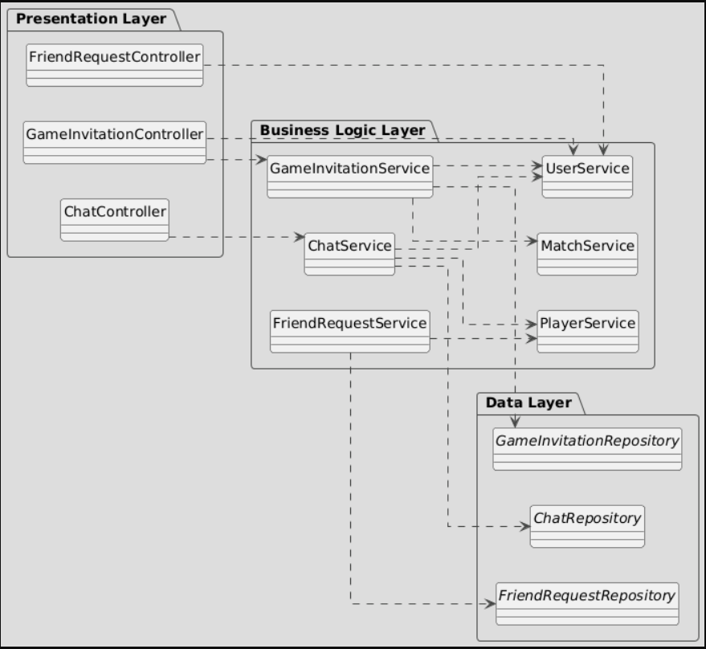

# Documento de diseño del sistema
**Asignatura:** Diseño y Pruebas (Grado en Ingeniería del Software, Universidad de Sevilla) 

**Curso académico:** 2025/2026

**Grupo/Equipo:** L2-01

**Nombre del proyecto:** Escape From Elba 

**Repositorio:** https://github.com/gii-is-DP1/dp1-2025-2026-l2-01

**Integrantes :**

Alberto Pardina Miñón (QSS7721 / albparmin@alum.us.es)<br>
Marco Visentin Lopez (CYB6650 / marvislop@alum.us.es)<br>
Emilio Diaz Arcenegui (FSS8078 / emidiaarc@alum.us.es)<br>
Nerea Camacho Perez (QFL3393 / nercamper@alum.us.es)<br>
Laura Cubero Sánchez (XNT3290 / laucubsan@alum.us.es)<br>
Lucía Baltasar Muñoz (SBJ4592 / lucbalmun@alum.us.es)<br>


## Introducción

Este proyecto se dedica a la implementación del juego de mesa llamado "Escape From Elba" de 1999, el cual por cada partida puede ser disfrutado desde 3 a 6 jugadores, con una duración media de 60 minutos.<br>

<div align="center">

</div>

### Materiales
Los materiales para jugar son muy simples, ya que se componen principalmente de dos:

- El tablero, el cual está formado por un distinto número de habitaciones, en cada una aparece su nombre (lo cual será importante para una de las mecánicas principales del juego) y dos dados, uno negro y otro blanco (los cuales servirán para colocar a los jugadores en habitaciones aleatorias).
<div align="center">

</div>

- Las cartas, en las cuales destacan dos partes esenciales. La primera letra del nombre de la carta, situada en la esquina superior izquierda y el conjunto de palabras de escape que se puede formar con esta letra.
<div align="center">

 </div>
 
### Objetivo
La partida comienza colocando a los visitantes, para esto cada uno lanza dos dados, uno negro y otro blanco, colocando a su personaje en la habitación que estos indiquen. Posteriormente se reparten 3 cartas a cada jugador (si deseas jugar con más de 6 jugadores, se recomienda repartir solo 2 cartas iniciales) y se elige a un jugador de manera aleatoria para que este comience, siendo el siguiente el de su izquierda.
El ojetivo trata de obtener un conjunto de cartas, ya sea robando del mazo o de otros jugadores, las cuales te permitan escapar, cada carta represnenta una letra (cada una muestra todas las palabras del juego en las que se encuentra), también puedes tener cartas boca arriba sobre la mesa las cuales se considerarán como tu "bolsa", estas cartas son las que te permitirán formar palabras que te ayuden a escapar, luchar y moverte por los alrededores. Para escapar es necesario ganar fuerza (todos los jugadores empiezan con 1 de fuerza), la cual se consigue haciendo batallas contra otros jugadores.

### Batallas
El jugador que entra a una habitación ya ocupada siempre será considerado como el atacante (en caso de empate, contará como victorioso), ambos jugadores lanzan un dado y se le suma sus puntos de fuerza (también es posible utilizar armas si puedes formarlas con la palabra de tu "bolsa"). Si pierdes la batalla contra otro jugador ganas fuerza (se descarta una carta a su elección de la mano o de la "bolsa" si es contra Niall Campbell). Sin embargo, si ganas contra otro jugador puedes elegir entre robar una carta de su "bolsa" o una aleatoria de su mano (la carta superior del mazo de descarte si es contra Niall Cambell o una del mazo de robo si es contra cualquier otro visitante NPC).

### Turnos
El primer paso es robar cartas, puedes robar cuantas cartas quieras hasta alcanzar 7 cartas en tu mano (dependiendo de cuantas cartas tengas afectará a los puntos de acción de tu turno). Si tienes 7 o más cartas, no recibes ningún punto de acción, si tienes menos, recibes 7 menos el número de cartas en tu mano, por ejemplo si tienes 5 cartas, obtienes 2 puntos.<br>

Puedes gastar tus puntos en diferentes acciones:<br>
- Moverte a una habitación adyacente a la tuya.<br>
- Mover a un jugador visitante NPC a una habitación adyacente a la suya.<br>
- Saltar a una habitación si eres capaz de formar algun nombre de alguna habitación con la palabra de tu "bolsa", por ejemplo si tienes "APPEARS", puedes dirigirte a "**SPA**" o a "SAFE **AREA**" (si es una palabra compuesta solo debes formar una de las palabras que la componen). Siempre y cuando no sea una torre de escape.<br>
- Hacer un intento de escape, siempre que estes en una de las torres de escape (a no ser que sea "EMPEROR" o "CAMPBELL", cuyas palabras pueden usarse en cualquier ubicación), puedas formar su nombre con la palabra en tu "bolsa". Para que el intento sea exitoso, debes lanzar un dado y sacar un número inferior a tu fuerza. Si el intento es fallido, se lanzna los dados para moverte a una habitación aleatoria.<br>
- Por ultimo, puedes descartarte de tantas cartas como quieras y debes vaciar tu mochila, quedandote con 2 letras o 3 si eres capaz de formar una palabra con estas.

### Vídeo explicativo de las normas de Escape From Elba
[https://youtu.be/JjQOi04i2-0?si=LMb-skomsHNsHqmz]

## Diagrama(s) UML:


### Diagrama de Dominio/Diseño


### Diagrama de Capas (incluyendo Controladores, Servicios y Repositorios)
_En esta sección debe proporcionar un diagrama UML de clases que describa el conjunto de controladores, servicios, y repositorios implementados, incluya la división en capas del sistema como paquetes horizontales tal y como se muestra en el siguiente ejemplo:_





*Nota importante para el alumno*: A la hora de entregar el proyecto, debes modificar la url para que esté asociada al respositorio concreto de tu proyecto. Date cuenta de que ahora mismo apunta al repositorio _gii-is-DP1/group-project-seed_.


_El diagrama debe especificar además las relaciones de uso entre controladores y servicios, entre servicios y servicios, y entre servicios y repositorios._
_Tal y como se muestra en el diagrama de ejemplo, para el caso de los repositorios se deben especificar las consultas personalizadas creadas (usando la signatura de su método asociado)._

_En este caso, como mermaid no soporta la definición de paquetes, hemos usado una [herramienta muy similar llamada plantUML}(https://www.plantuml.com/). Esta otra herramienta tiene un formulario para visualizar los diagramas previamente disponible en [https://www.plantuml.com/plantuml/uml/}(https://www.plantuml.com/plantuml/uml/). Lo que hemos hecho es preparar el diagrama en ese formulario, y una vez teníamos el diagrama lista, grabarlo en un fichero aparte dentro del propio repositorio, y enlazarlo con el formulario para que éste nos genera la imagen del diagrama usando una funcionalizad que nos permite especificar el código del diagrama a partir de una url. Por ejemplo, si accedes a esta url verás el editor con el código cargado a partir del fichero del repositorio original: [http://www.plantuml.com/plantuml/proxy?cache=no&src=https://raw.githubusercontent.com/gii-is-DP1/group-project-seed/main/docs/diagrams/LayersUMLPackageDiagram.iuml](http://www.plantuml.com/plantuml/proxy?cache=no&src=https://raw.githubusercontent.com/gii-is-DP1/group-project-seed/main/docs/diagrams/LayersUMLPackageDiagram.iuml)._

## Descomposición del mockups del tablero de juego en componentes

En esta sección procesaremos los mockup del tablero de juego. Etiquetaremos las zonas de cada una de las pantallas para identificar componentes a implementar. Para cada mockup se especificará el árbol de jerarquía de componentes, así como, para cada componente el estado que necesita mantener, las llamadas a la API que debe realizar y los parámetros de configuración global que consideramos que necesita usar cada componente concreto. 
Componentes de la pantalla de juego principal:


  - App – Componente principal de la aplicación
    - $\color{pink}{\textsf{PlayersAvatar – Muestra los avatares de los N jugadores de la actual partida.}}$
    - $\color{darkblue}{\textsf{Map – Área de juego principal.}}$
       - $\color{blue}{\textsf{Rooms – Conjunto de habitaciones que hay en el mapa.}}$
    - $\color{yellow}{\textsf{DiscardPile – Muestra el mazo de cartas de descarte.}}$
    - $\color{red}{\textsf{Deck – Muestra el mazo de cartas de robo.}}$
       - $\color{yellow}{\textsf{DeckButton – Permite al jugador robar una carta del mazo de robo.}}$
    - $\color{purple}{\textsf{PlayerInformation – Muestra toda la información relevante sobre tu partida personal, como las cartas en tu poseson (mano o bolsa), tus puntos de fuerza y de acción, un boton para elegir tu acción y el botón del chat.}}$
       - $\color{orange}{\textsf{ChatButton – Boton para abrir el chat}}$
       - $\color{gray}{\textsf{ActionsButton – Boton para abrir el menu de acciones disponibles en tu ronda.}}$
       - $\color{darkred}{\textsf{HandCards - Muestra un listado de tus cartas en la mano.}}$
       - $\color{darkgreen}{\textsf{BagCards – Muestra un listado de tus cartas en la bolsa. }}$
       - $\color{green}{\textsf{ActionPoints – Muestra los puntos de acción disponibles en tu ronda.}}$
       - $\color{cyan}{\textsf{Strength – Muestra tus puntos de fuerza actuales.}}$


## Patrones de diseño y arquitectónicos aplicados
En esta sección de especificar el conjunto de patrones de diseño y arquitectónicos aplicados durante el proyecto.

### Patrón: Modelo-Vista-Controlador(MVC)
*Tipo*: de Diseño

*Contexto de Aplicación*

La aplicación tiene diferentes secciones estructuradas siguiendo el patrón MVC, dividiendo su funcionalidad en varias capas bien diferenciadas: entidades del modelo, repositorios, servicios y controladores. El framework Spring fomenta esta organización.

*Clases o paquetes creados*

 -Models
 -Repositories
 -Services
 -Controllers

*Ventajas alcanzadas al aplicar el patrón*

La aplicación del patrón MVC permite una clara separación entre la lógica de negocio (capa service), las entidades y acceso a datos (capas models y repositories) y la comunicación con el frontend (capa controller). Esta división mejora la organización del proyecto, facilita el trabajo en equipo y optimiza el mantenimiento y la evolución del sistema.


### Patrón: Dependency Injection
*Tipo*: de Diseño?

*Contexto de Aplicación*

La aplicación delega la creación de dependencias, objetos que una clase necesita para funcionar, a un contenedor externo en lugar de que la propia clase las cree directamente. En Spring Boot, esto lo hace el contenedor de Spring, que se encarga de instanciar e inyectar los objetos (beans) necesarios en cada clase

*Clases o paquetes creados*

La inyección de dependencias se aplica a través de anotaciones de Spring ya que esta integrado directamente en el framework de Spring Boot por lo que no ha sido necesaria la creación de clases o paquetes para este patrón. 

*Ventajas alcanzadas al aplicar el patrón*

La aplicación del patrón Dependency Injection facilita cambiar las dependencias sin tener que modificar el código principal ya que las clases no dependen de implementaciones concretas, sino de interfaces o abstracciones. Permite también la alta reutilización y mantenebilidad ya que es posible modificar la lógica de una clase sin tocar el servicio que la usa. Por otro lado, también se consigue un código más limpio y organizado.


### Patrón: Data Transfer Object (DTO)
*Tipo*: de Diseño

*Contexto de Aplicación*

La aplicación para evitar exponer datos internos de algunas clases relacionados con la base de datos interna a la hora de transportar la información de una capa a otra utiliza varios objetos DTO para realizar esta transferencia.

*Clases o paquetes creados*

-LobbyDTO
-ChatDTO
-MiniUserDTO
-MiniRequestDTO


*Ventajas alcanzadas al aplicar el patrón*

La aplicación del patrón Data Transfer Object protege la lógica interna de la aplicación y evita exponer campos sensibles, el frontend al no depender directamente de las entidades del backend gracias a esto favorece el bajo acoplamiento entre capas. Otra ventaja es la optimización de la transferencia de datos ya que se reduce el tamaño de las respuestas al enviar solo los datos necesarios.

### Patrón: Prototype
*Tipo*: de Diseño 

*Contexto de Aplicación*
Usamos este patrón sobre todo al iniciar elementos de la partida como en nuestra caso, la baraja. Al iniciar una partida se coge cada carta de la baraja original almacenada y se hace una copia de ella, para formar una baraja completa copiada. 


*Clases o paquetes creados*
-paquete patterns 
-clase Prototype.java
 

*Ventajas alcanzadas al aplicar el patrón*
Conseguimos crear copias exacta de una entidad de forma sencilla. 

### Patrón: 
*Tipo*: Arquitectónico o De Diseño

*Contexto de Aplicación*


*Clases o paquetes creados*

 

*Ventajas alcanzadas al aplicar el patrón*


## Decisiones de diseño


### Decisión X
#### Descripción del problema:*

Describir el problema de diseño que se detectó, o el porqué era necesario plantearse las posibilidades de diseño disponibles para implementar la funcionalidad asociada a esta decisión de diseño.

#### Alternativas de solución evaluadas:
Especificar las distintas alternativas que se evaluaron antes de seleccionar el diseño concreto implementado finalmente en el sistema. Si se considera oportuno se pude incluir las ventajas e inconvenientes de cada alternativa

#### Justificación de la solución adoptada

Describir porqué se escogió la solución adoptada. Si se considera oportuno puede hacerse en función de qué  ventajas/inconvenientes de cada una de las soluciones consideramos más importantes.
Os recordamos que la decisión sobre cómo implementar las distintas reglas de negocio, cómo informar de los errores en el frontend, y qué datos devolver u obtener a través de las APIs y cómo personalizar su representación en caso de que sea necesario son decisiones de diseño relevantes.

_Ejemplos de uso de la plantilla con otras decisiones de diseño:_

### Decisión 1: Importación de datos reales para demostración
#### Descripción del problema:

Como grupo nos gustaría poder hacer pruebas con un conjunto de datos reales suficientes, porque resulta más motivador. El problema es al incluir todos esos datos como parte del script de inicialización de la base de datos, el arranque del sistema para desarrollo y pruebas resulta muy tedioso.

#### Alternativas de solución evaluadas:

*Alternativa 1.a*: Incluir los datos en el propio script de inicialización de la BD (data.sql).

*Ventajas:* <br>
•	Simple, no requiere nada más que escribir el SQL que genere los datos. <br>
*Inconvenientes:* <br>
•	Ralentiza todo el trabajo con el sistema para el desarrollo. <br>
•	Tenemos que buscar nosotros los datos reales <br>

*Alternativa 1.b*: Crear un script con los datos adicionales a incluir (extra-data.sql) y un controlador que se encargue de leerlo y lanzar las consultas a petición cuando queramos tener más datos para mostrar. <br>
*Ventajas:* <br>
•	Podemos reutilizar parte de los datos que ya tenemos especificados en (data.sql). <br>
•	No afecta al trabajo diario de desarrollo y pruebas de la aplicación <br>
*Inconvenientes:* <br>
•	Puede suponer saltarnos hasta cierto punto la división en capas si no creamos un servicio de carga de datos. <br>
•	Tenemos que buscar nosotros los datos reales adicionales <br>

*Alternativa 1.c*: Crear un controlador que llame a un servicio de importación de datos, que a su vez invoca a un cliente REST de la API de datos oficiales de XXXX para traerse los datos, procesarlos y poder grabarlos desde el servicio de importación.

*Ventajas:* <br>
•	No necesitamos inventarnos ni buscar nosotros lo datos. <br>
•	Cumple 100% con la división en capas de la aplicación. <br>
•	No afecta al trabajo diario de desarrollo y pruebas de la aplicación <br>
*Inconvenientes:* <br>
•	Supone mucho más trabajo. <br>
•	Añade cierta complejidad al proyecto <br>

*Justificación de la solución adoptada* <br>
Como consideramos que la división en capas es fundamental y no queremos renunciar a un trabajo ágil durante el desarrollo de la aplicación, seleccionamos la alternativa de diseño 1.c.


### Decisión 2
#### Descripción del problema:*

Hemos decidido implementar en nuestra aplicación cuando te unes a una partida una sala de espera hasta que se de por empezado el propio juego. El crear una sala de espera trata los mismos datos que una partida pero maneja una logica diferente por lo que tuvimos que pensar como lo ibamos a organizar.

#### Alternativas de solución evaluadas:

*Alternativa 2.a* : Añadir la lógica de negocio del lobby en el propio MatchService
*Ventajas:*
•	Una clase que gestiona todo, lobbies y partidas, hace que sea más simple.
•	Hay menos servicios que implementar.
•	No se necesita coordinación entre distintos servicios.
*Inconvenientes:*
• La lógica de lobby y de partida se mezcla, lo que hace que la clase sea más grande y difícil de mantener.
• Añadir nuevas funcionalidades de lobby afecta directamente a la lógica de la partida.
• Difícil de testear de forma aislada.

*Alternativa 2.b* : Crear un servicio LobbyService para gestionar la lógica.
*Ventajas:*
•	Hace el código más fácil de entender, mantener y testear.
•	Se separan las responsabilidades.
•	Permite añadir funcionalidades específicas del lobby sin tocar la lógica de partidas.
*Inconvenientes:*
• Más código y más estructura que mantener.
• Hay que pasar datos de LobbyService a MatchService cuando se inicia la partida.


#### Justificación de la solución adoptada

Consideramos que es más importante usar la opción que nos permita separar las responsabilidades ya que es un proyecto que vamos a ir actualizando y añadiendo código por lo que es mejor que los cambios que hagamos no afecten a toda una partida, por eso hemos decidido crear el servicio LobbyService.


### Decisión 3
#### Descripción del problema:*

A la hora de construir los services nos hemos visto con una gran cantidad de validaciones que comprobar por lo que hemos tenido que decidir cual sería la mejor manera de implementar estas validaciones.

#### Alternativas de solución evaluadas:

*Alternativa 3.a* : Añadir directamente cada validación en la función que la necesite.
*Ventajas:*
• No hay que crear nuevas clases ni abstraer la lógica, todo está “donde se usa”, por lo que es más simple.
*Inconvenientes:*
• La misma restricción puede necesitarse en varias funciones, y si se modifica, hay que actualizar todas.
• Cambiar una regla implica revisar múltiples funciones, aumentando riesgo de errores.
• La lógica de juego queda mezclada con servicios o controladores, dificultando extensiones o reutilización.

*Alternativa 3.b* : Crear una clase checkers con todas las restricciones.
*Ventajas:*
• Todas las reglas del juego están en un solo lugar, fácil de localizar y modificar.
•	Otras partes del sistema (MatchService, frontend, tests) pueden reutilizar la misma lógica sin duplicarla.
•	Si cambia una regla del juego, solo se modifica en la clase Checkers.
*Inconvenientes:*
• Los servicios (como MatchService) deben interactuar con la clase Checkers correctamente, lo que añade un nivel de abstracción.


#### Justificación de la solución adoptada

Consideramos que al tener muchas restricciones que son reutilizables nos va a facilitar mucho el tener una clase Checkers, también nos va a facilitar la lectura del código.

_Ejemplos de uso de la plantilla con otras decisiones de diseño:_

## Refactorizaciones aplicadas

Si ha hecho refactorizaciones en su código, puede documentarlas usando el siguiente formato:

### Refactorización X: 
En esta refactorización añadimos un mapa de parámtros a la partida para ayudar a personalizar la información precalculada de la que partimos en cada fase del juego.
#### Estado inicial del código
```Java 
class Animal
{
}
``` 
_Puedes añadir información sobre el lenguaje concreto en el que está escrito el código para habilitar el coloreado de sintaxis tal y como se especifica en [este tutorial](https://docs.github.com/es/get-started/writing-on-github/working-with-advanced-formatting/creating-and-highlighting-code-blocks)_

#### Estado del código refactorizado

```
código fuente en java, jsx o javascript
```
#### Problema que nos hizo realizar la refactorización
_Ej: Era difícil añadir información para implementar la lógica de negocio en cada una de las fases del juego (en nuestro caso varía bastante)_
#### Ventajas que presenta la nueva versión del código respecto de la versión original
_Ej: Ahora podemos añadir arbitrariamente los datos que nos hagan falta al contexto de la partida para que sea más sencillo llevar a cabo los turnos y jugadas_
